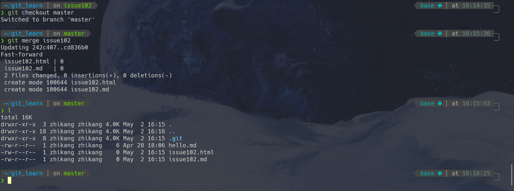
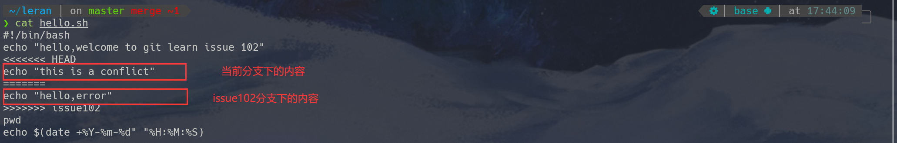
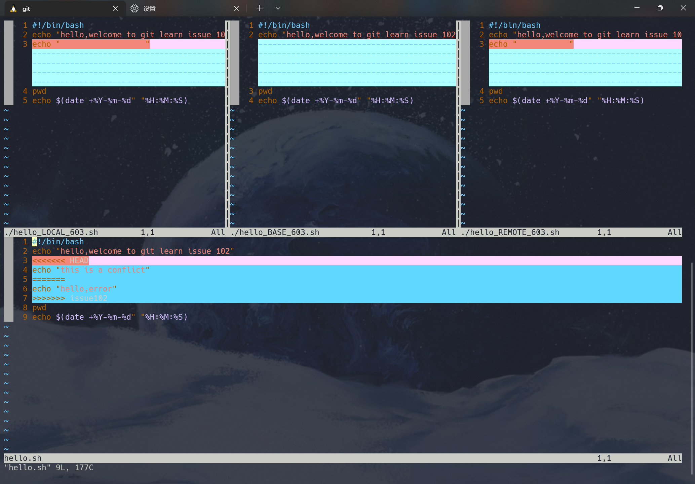

# Chapter 3: Git Branch Management

## 3.1 Introduction to Branches

The most important use case for Git is collaborative development with multiple people. But how can we ensure that each person's development work doesn't interfere with others' progress? Git branches solve this problem by making each person's development independent and non-interfering.

Some people call Git's branching model its "killer feature," and it is precisely this feature that makes Git stand out among many version control systems. Why is Git's branching model so outstanding? Because Git handles branches in an incredibly lightweight manner—creating a new branch can be completed almost instantly, and switching between different branches is equally convenient. Unlike many other version control systems, Git encourages frequent use of branching and merging in workflows, even multiple times a day. Understanding and mastering this feature will make you realize how powerful and unique Git is, and will truly change the way you develop from then on.

## 3.2 Branch Operations

### 3.2.1 Creating Branches

Creating Git branches is very simple. We can use `git branch` to view existing branches or create new ones. When entered without any command parameters, `git branch` helps us view all branches that the current project has. Git uses an asterisk (*) to indicate which branch we are currently on.

```bash
git branch
```

```bash
* master
```

When we want to add a new branch, we simply need to add the name of the branch we want to create after the `git branch` command.

```bash
# Create the issue102 branch
git branch issue102
# View all existing branches
git branch
```

```bash
# Existing branches
issue102
*master
```

We can see that although the `issue102` branch has been created, the current branch is still on master. We can use the `git checkout` command to switch branches.

### 3.2.2 Switching Branches

In the example above, we found that although a new branch was created, the current branch is still on the `master` branch. We need to use the `git checkout` command to switch to the newly created `issue102` branch to continue with subsequent development operations.

```bash
git checkout issue102
```

```bash
Switched to branch 'issue102'
```

Now we can check the current branch status again, and we can see that the current branch has switched to the `issue102` branch.

```bash
git branch
* issue102
master
```

After switching branches, we can proceed with our own development. The file states on branches are different. We can gain a deeper understanding through the following example.

```bash
# Switch branches
git checkout issue102

# Create new files on the branch
touch issue102.md
git add issue102.md
git commit -m "update issue102.md"

touch issue102.html
git add issue102.html
git commit -m "update issue102.html"
```

After completing the above commands, we can check the current Git log using `git log --oneline`.

```bash
cd836b0 (HEAD -> issue102) update issue102.html
7575f02 update issue102.md
242c407 (master) update hello.md
```

We can see that the records on the issue102 branch are separated from the master records. In addition, when we switch back to the main branch, we will also find that the master branch does not have the newly created issue102.md and issue102.html files. As shown in the figure below:


### 3.2.3 Merging Branches

After completing development work on a branch, we need to merge the work we've done on the current branch into the main branch. First, we need to switch back to the branch we want to merge into. Here we'll demonstrate using the example of merging `issue102` into `master`.

```bash
# Switch back to the main branch
git checkout master
# Use git merge to perform the merge
git merge issue102
# git branch --no-merged
# View all branches with unmerged work
```



We can see that the files originally on the `issue102` branch have been merged into the main branch, and the `issue102` branch still exists. You can choose to keep or delete branches based on actual needs.

Sometimes branch merging doesn't go smoothly. When we make different modifications to the same part of the same file in two branches, Git cannot merge them smoothly and will produce a merge conflict during the merge. For example, if we modify the `issue102.md` file in both the `issue102` branch and the `master` branch, a conflict will occur when we merge the issue102 branch into the main branch. As shown in the figure below:


We can also use the `git status` command to view files that are in an unmerged state due to merge conflicts. When conflicts occur, the merged file content will be marked with dividing lines such as "<<<<<<", "=======", and ">>>>>>". As shown in the figure below:



When conflicts occur, we need to resolve them manually or abandon the merge.

- Manual Merge

	The manual merge method is simple: we select the code we want to keep, then remove the prompt lines like >>>>>>, ======, and <<<<<<. Finally, we perform the add and commit operations again.

- Abandon Merge

	When we find that the changes caused by conflicts are extensive, we can choose to abandon the merge. We can use `git merge --abort` to abandon this merge. If we made some manual changes after running git merge, those changes will also be rolled back after abort.

- mergetool

	In addition to manual merging and abandoning merges, we have some other merge tools. Git officially developed a tool specifically for merging called git mergetool (shown in the figure below). It will find a copy of the ancestor code from both branches as the base, then list the changes from both branches for comparison, allowing us to decide what to keep in the git editor. We won't elaborate too much here; interested readers can click the links below for more information.

	1. [Use vimdiff as git mergetool](https://www.rosipov.com/blog/use-vimdiff-as-git-mergetool/)
	2. [使用vimdiff作为git mergetool](https://kinboyw.github.io/2018/10/09/Use-Vimdiff-As-Git-Mergetool/)
	3. [git-mergetool](https://www.lhsz.xyz/read/git-doc-zh/docs-16.md)



### 3.2.4 Pushing Branches to Remote

In many cases, we need to push branches to remote repositories. In this section, we'll discuss some remote-related operations.

First, we can use `git remote -v` to view detailed information about the remote repository. It will display the origin addresses we can fetch from or push to.

```bash
$ git remote -v
origin  git@github.com:ProjectOwner/ProjectName.git (fetch)
origin  git@github.com:ProjectOwner/ProjectName.git (push)
```

When we need to push a local branch to remote, we need to specify the specific local branch.

```bash
# Push the local master branch to remote
git push origin master
# Push the local issue102 branch to remote
git push origin issue102
```

However, when multiple people collaborate on development, the remote branch may be more up-to-date than our local one. In this case, we need to use the `git pull` command to attempt a merge. If conflicts occur during the merge, we need to resolve the conflicts before committing. For this section, we recommend checking out Liao Xuefeng's Git tutorial on

[Multi-person Collaboration](https://www.liaoxuefeng.com/wiki/896043488029600/900375748016320). If there are any copyright concerns, please contact us.

### 3.2.5 Deleting Branches

In Git, there is no branch that cannot be deleted (except for the branch you are currently on), including the `master` branch.

Git branch deletion can be divided into deleting local branches and remote branches.

- Deleting Local Branches

```bash
# branchName is the name of the local branch to be deleted
git branch -d branchName
```

When we want to force delete a branch, we simply need to change the parameter d to D.

- Deleting Remote Branches

```bash
# origin is the remote host name
# branch is the remote branch to be deleted
git push origin --delete branch
```

### 3.2.6 Renaming Branches

When we need to rename a branch, we can use the `git branch` command as follows:

```bash
# oldBranchName: old branch name
# newBranchName: new branch name
git branch -m oldBranchName newBranchName
```

When we want to push the renamed branch to remote, we need to perform the following operations:

```bash
git branch -m oldBranchName newBranchName   # Rename the local branch
git push origin newBranchName               # Push the new branch to remote        
git push --delete origin oldBranchName      # Delete the old branch from remote 
```

## 3.3 Branching Workflows

After understanding branch operations, we should consider what approach to use to maximize the advantages of branch operations. In this section, we will introduce some common branching workflow patterns. It is precisely because of the convenience of branch management that these typical working modes have emerged, which we can use according to the actual situation of the project in the future.

### 3.3.1 Long-Running Branches

At different stages of the entire project development cycle, we can have multiple branches simultaneously; then we can regularly merge certain topic branches into other branches. Many Git developers like to work this way, for example, keeping only completely stable code on the master branch—possibly only code that has been released or is about to be released. They also have parallel branches named develop or next, which are used for subsequent development or stability testing—these branches don't need to remain absolutely stable, but once they reach a stable state, they can be merged into the master branch. This way, after ensuring that these completed topic branches (short-term branches, such as the previous issue102 branch) can pass all tests and won't introduce more bugs, they can be merged into the main branch, waiting for the next release.


### 3.3.2 Short-Term Branches

Short-term branches can also be called topic branches. Their purpose is to implement a specific feature or related work (fixing bugs, developing new product features). For example, when our product has a bug, we should create a new branch and name it a bug branch, and fix the bug on that branch. When we're sure our code won't cause other bugs, we can merge it into the main branch for the fix. When we see an issue, we can also use the same approach to solve the issue. Common short-term branches also include the develop and topic branches mentioned above. In actual development, we should follow these basic principles for branching workflow:

1. The master branch should be the most stable, meaning it should only be used to release new versions. We shouldn't work directly on it normally, and it should be kept on the remote.
2. Short-term branches are our working branches. Short-term branches don't need to be uploaded to remote until we've completed bug fixes or new feature development and need to merge them into the main branch.
3. Use branches frequently for development work.
