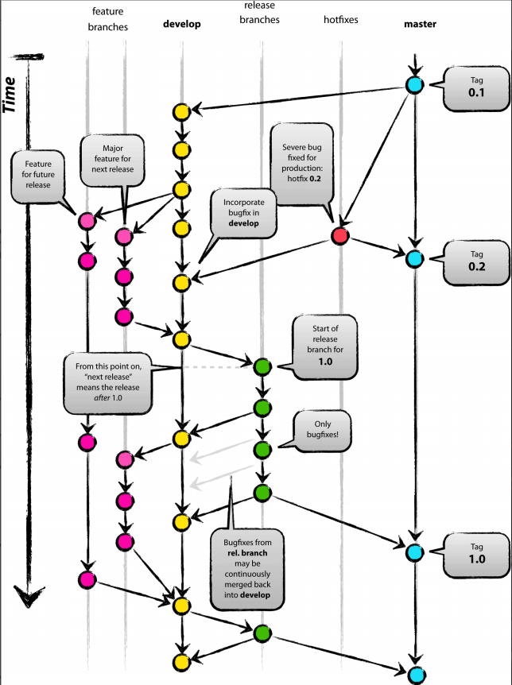

# Chapter 6: GitFlow Workflow in Practice

## 6.0 Introduction

In actual project development, there are often multiple work stages such as self-testing, integration testing, QA submission, and production hotfixes, which may require code deployment across various environments including local, internal testing, development, testing, and production. Each stage generates different branches. This article starts from the principles of the Git-Flow model, demonstrates practical operational methods through command-line examples, and provides a summary. The ultimate goal is to apply Git-Flow in real projects to efficiently complete code development, version management, and other practical tasks.

(Note: Different companies or projects may have different GitFlow workflow model standards. Please follow the actual application requirements. This article provides a commonly used template that is comprehensive and universal. It is recommended to practice extensively to achieve proficiency.)

## 6.1 Deep Understanding of Git-Flow Workflow Model Principles

- What problems does the Git-Flow model solve?

  It addresses various issues arising from the severe coupling of code development, testing, bug fixes, version releases, and other processes in actual projects, such as excessive conflicts and version chaos.

- How does the Git-Flow model solve these problems?

  By defining 5 types of branches based on Git, with each branch having strictly defined responsibilities, starting and ending points, etc., enabling development, testing, and release processes to proceed in an orderly manner.

### 6.1.1 Git-Flow Flowchart

This flowchart provides a complete description of the Git-Flow model process. When we deeply understand each branch and combine it with the project stage and our own role (developer/tester/project manager), we will find that each role may only need to focus on one or two branches at a certain stage. For example, during the development stage, developers only need to focus on their own feature branches; during the release stage, both testers and developers only need to focus on the Release branch, with their respective responsibilities being different. The details are shown in the following diagram (readers are encouraged to hand-draw this flowchart once to deepen understanding):



### 6.1.2 Description of Git-Flow Branches

| Branch Name | Purpose | Lifecycle | Commit or Merge | Starting and Ending Points |
| --------------------- | ------------------------- | ------------- | ---------------------------------------- | -------------------------------------- |
| Feature Branch | For developing a specific feature | Temporary branch, development stage | Can commit code | Created from Develop branch, eventually merged back to Develop branch |
| Develop Branch | Records historical development features | Throughout the entire project | Cannot commit directly, receives merged code from Feature, Bugfix, Release, and Hotfix branches | Throughout the entire project |
| Release Branch | For current release including documentation, testing, and bug fixes | Temporary branch, release stage | Can commit code | Created from Develop branch, eventually merged to both Develop and Master branches |
| Hotfix Branch | For fixing production bugs | Temporary branch, emergency fix stage | Can commit code | Created from Master branch, eventually merged to both Develop and Master branches |
| Master (Production) Branch | Records historical release versions | Throughout the entire project | Cannot commit directly, receives merged code from Release and Hotfix branches | Throughout the entire project |

### 6.1.3 Understanding Branches from Different Perspectives

- Lifecycle

  Master and Develop branches span the entire project; all other branches are temporary branches with specific responsibilities.

- Project Stages

  **Development stage** mainly involves Feature and Develop branches; **Release stage** mainly involves Release, Production, and Develop branches; **Emergency fix stage** mainly involves Hotfix, Production, and Develop branches.

- Team Member Focus

  **Developers** focus on Develop and Feature branches, and during special stages, focus on bug fixes in Hotfix and Release branches; **Testers** focus on functional testing of Release and Hotfix branches; **Project managers** focus on Production and Release branches.

Additionally, it should be noted that project stages may overlap in the time dimension. For example, the release stage (current version) and the development stage of the next version can coexist, because the initiation of the current release stage also means the beginning of the development stage for the next release. Once a bug appears in production (which can happen at any time), the emergency fix stage may overlap with the development stage and release stage... Therefore, all team members are required to understand the Git-Flow workflow and their current project stage.

## 6.2 Command Line Demonstration of a Complete Git-Flow Process

Theory is always dry, so let's practice a complete process from feature development to version release to experience the specific operations of Git-Flow.

> Note: The following shell commands are demonstrated using Git Bash in the '/e/PycharmProjects/DatawhaleChina' directory on a Windows 10 environment. Lines with the '\$' symbol are demonstration commands, and any output will be displayed below the line containing the '\$' symbol.

### 6.2.1 Initialize Project and Create Develop Branch

```shell
Administrator@WIN MINGW64 /e/PycharmProjects/DatawhaleChina
$ pwd
/e/PycharmProjects/DatawhaleChina

Administrator@WIN MINGW64 /e/PycharmProjects/DatawhaleChina
$ mkdir git-demo-workflow-project

Administrator@WIN MINGW64 /e/PycharmProjects/DatawhaleChina
$ cd git-demo-workflow-project/

Administrator@WIN MINGW64 /e/PycharmProjects/DatawhaleChina/git-demo-workflow-project
$ touch readme.md

Administrator@WIN MINGW64 /e/PycharmProjects/DatawhaleChina/git-demo-workflow-project
$ git init
Initialized empty Git repository in E:/PycharmProjects/DatawhaleChina/git-demo-workflow-project/.git/

Administrator@WIN MINGW64 /e/PycharmProjects/DatawhaleChina/git-demo-workflow-project (master)
$ git add .

Administrator@WIN MINGW64 /e/PycharmProjects/DatawhaleChina/git-demo-workflow-project (master)
$ git commit -m "init"
[master (root-commit) 1ae2455] init
 1 file changed, 0 insertions(+), 0 deletions(-)
 create mode 100644 readme.md

Administrator@WIN MINGW64 /e/PycharmProjects/DatawhaleChina/git-demo-workflow-project (master)
$ git checkout -b develop master
Switched to a new branch 'develop'


```

### 6.2.2 Simulate Development Stage Process

(Create a new Feature branch, implement a user login module, then merge to Develop branch, and delete the feature branch)

```shell

Administrator@WIN MINGW64 /e/PycharmProjects/DatawhaleChina/git-demo-workflow-project (develop)
$ git checkout -b feature-login develop
Switched to a new branch 'feature-login'

Administrator@WIN MINGW64 /e/PycharmProjects/DatawhaleChina/git-demo-workflow-project (feature-login)
$ touch LoginUser.html

Administrator@WIN MINGW64 /e/PycharmProjects/DatawhaleChina/git-demo-workflow-project (feature-login)
$echo "hi, this is user html" > LoginUser.html

Administrator@WIN MINGW64 /e/PycharmProjects/DatawhaleChina/git-demo-workflow-project (feature-login)
$ cat LoginUser.html
hi, this is user html

Administrator@WIN MINGW64 /e/PycharmProjects/DatawhaleChina/git-demo-workflow-project (feature-login)
$ ls
LoginUser.html  readme.md

Administrator@WIN MINGW64 /e/PycharmProjects/DatawhaleChina/git-demo-workflow-project (feature-login)
$ git add .
warning: LF will be replaced by CRLF in LoginUser.html.
The file will have its original line endings in your working directory

Administrator@WIN MINGW64 /e/PycharmProjects/DatawhaleChina/git-demo-workflow-project (feature-login)
$ git commit -m "feat: add LoginUser.html"
[feature-login 182444e] feat: add LoginUser.html
 1 file changed, 1 insertion(+)
 create mode 100644 LoginUser.html

Administrator@WIN MINGW64 /e/PycharmProjects/DatawhaleChina/git-demo-workflow-project (feature-login)
$ touch LoginUser.js


Administrator@WIN MINGW64 /e/PycharmProjects/DatawhaleChina/git-demo-workflow-project (feature-login)
$ echo "hi, this is user js" > LoginUser.js

Administrator@WIN MINGW64 /e/PycharmProjects/DatawhaleChina/git-demo-workflow-project (feature-login)
$ git add .
warning: LF will be replaced by CRLF in LoginUser.js.
The file will have its original line endings in your working directory

Administrator@WIN MINGW64 /e/PycharmProjects/DatawhaleChina/git-demo-workflow-project (feature-login)
$ git commit -m "feat: add LoginUser.js"
[feature-login b0d494c] feat: add LoginUser.js
 1 file changed, 1 insertion(+)
 create mode 100644 LoginUser.js

Administrator@WIN MINGW64 /e/PycharmProjects/DatawhaleChina/git-demo-workflow-project (feature-login)
$ git status
On branch feature-login
nothing to commit, working tree clean

Administrator@WIN MINGW64 /e/PycharmProjects/DatawhaleChina/git-demo-workflow-project (feature-login)
$ git checkout develop
Switched to branch 'develop'

Administrator@WIN MINGW64 /e/PycharmProjects/DatawhaleChina/git-demo-workflow-project (develop)
$ git merge --no-ff feature-login
Merge made by the 'recursive' strategy.
 LoginUser.html | 1 +
 LoginUser.js   | 1 +
 2 files changed, 2 insertions(+)
 create mode 100644 LoginUser.html
 create mode 100644 LoginUser.js

Administrator@WIN MINGW64 /e/PycharmProjects/DatawhaleChina/git-demo-workflow-project (develop)
$ git branch -d feature-login
Deleted branch feature-login (was b0d494c).


```

### 6.2.3 Simulate Release Stage Process

(Create Release branch, perform bug fixes, merge to Production and Develop branches)

```shell
Administrator@WIN MINGW64 /e/PycharmProjects/DatawhaleChina/git-demo-workflow-project (develop)
$ git checkout  -b release-v0.1 develop
Switched to a new branch 'release-v0.1'

Administrator@WIN MINGW64 /e/PycharmProjects/DatawhaleChina/git-demo-workflow-project (release-v0.1)
$ echo "bugifx LoginUser.html" >> LoginUser.html

Administrator@WIN MINGW64 /e/PycharmProjects/DatawhaleChina/git-demo-workflow-project (release-v0.1)
$ git add .
warning: LF will be replaced by CRLF in LoginUser.html.
The file will have its original line endings in your working directory

Administrator@WIN MINGW64 /e/PycharmProjects/DatawhaleChina/git-demo-workflow-project (release-v0.1)
$ git commit -m "fix: bugfix for LoginUser.html"
[release-v0.1 a37a88c] fix: bugfix for LoginUser.html
 1 file changed, 1 insertion(+)

Administrator@WIN MINGW64 /e/PycharmProjects/DatawhaleChina/git-demo-workflow-project (release-v0.1)
$ git checkout master
Switched to branch 'master'

Administrator@WIN MINGW64 /e/PycharmProjects/DatawhaleChina/git-demo-workflow-project (master)
$ git merge --no-ff release-v0.1
Merge made by the 'recursive' strategy.
 LoginUser.html | 2 ++
 LoginUser.js   | 1 +
 2 files changed, 3 insertions(+)
 create mode 100644 LoginUser.html
 create mode 100644 LoginUser.js

Administrator@WIN MINGW64 /e/PycharmProjects/DatawhaleChina/git-demo-workflow-project (master)
$ git tag v0.1

Administrator@WIN MINGW64 /e/PycharmProjects/DatawhaleChina/git-demo-workflow-project (master)
$ git checkout develop
Switched to branch 'develop'

Administrator@WIN MINGW64 /e/PycharmProjects/DatawhaleChina/git-demo-workflow-project (develop)
$ git merge --no-ff release-v0.1
Merge made by the 'recursive' strategy.
 LoginUser.html | 1 +
 1 file changed, 1 insertion(+)

Administrator@WIN MINGW64 /e/PycharmProjects/DatawhaleChina/git-demo-workflow-project (develop)
$ git branch -d release-v0.1
Deleted branch release-v0.1 (was a37a88c).

```

### 6.2.4 Simulate Production Failure and Create Hotfix Branch

(Create Hotfix branch, perform bug fixes, merge to Production and Develop branches)

```shell
Administrator@WIN MINGW64 /e/PycharmProjects/DatawhaleChina/git-demo-workflow-project (master)
$ git checkout -b hotfix-v0.1.1 master
Switched to a new branch 'hotfix-v0.1.1'

Administrator@WIN MINGW64 /e/PycharmProjects/DatawhaleChina/git-demo-workflow-project (hotfix-v0.1.1)
$ git status
On branch hotfix-v0.1.1
nothing to commit, working tree clean

Administrator@WIN MINGW64 /e/PycharmProjects/DatawhaleChina/git-demo-workflow-project (hotfix-v0.1.1)
$ echo "hotfix for LoginUser.html" >> LoginUser.html

Administrator@WIN MINGW64 /e/PycharmProjects/DatawhaleChina/git-demo-workflow-project (hotfix-v0.1.1)
$ cat LoginUser.html
hi, this is user html
bugifx LoginUser.html
hotfix for LoginUser.html

Administrator@WIN MINGW64 /e/PycharmProjects/DatawhaleChina/git-demo-workflow-project (hotfix-v0.1.1)
$ git add .
warning: LF will be replaced by CRLF in LoginUser.html.
The file will have its original line endings in your working directory

Administrator@WIN MINGW64 /e/PycharmProjects/DatawhaleChina/git-demo-workflow-project (hotfix-v0.1.1)
$ git commit -m "hotfix: do something for LoginUser.html"
[hotfix-v0.1.1 bcb680e] hotfix: do something for LoginUser.html
 1 file changed, 1 insertion(+)

Administrator@WIN MINGW64 /e/PycharmProjects/DatawhaleChina/git-demo-workflow-project (hotfix-v0.1.1)
$ git checkout master
Switched to branch 'master'

Administrator@WIN MINGW64 /e/PycharmProjects/DatawhaleChina/git-demo-workflow-project (master)
$ git merge --no-ff hotfix-v0.1.1
Merge made by the 'recursive' strategy.
 LoginUser.html | 1 +
 1 file changed, 1 insertion(+)

Administrator@WIN MINGW64 /e/PycharmProjects/DatawhaleChina/git-demo-workflow-project (master)
$ git tag v0.1.1

Administrator@WIN MINGW64 /e/PycharmProjects/DatawhaleChina/git-demo-workflow-project (master)
$ git checkout develop
Switched to branch 'develop'

Administrator@WIN MINGW64 /e/PycharmProjects/DatawhaleChina/git-demo-workflow-project (develop)
$ git merge --no-ff hotfix-v0.1.1
Merge made by the 'recursive' strategy.
 LoginUser.html | 1 +
 1 file changed, 1 insertion(+)

Administrator@WIN MINGW64 /e/PycharmProjects/DatawhaleChina/git-demo-workflow-project (develop)
$ git branch -d hotfix-v0.1.1
Deleted branch hotfix-v0.1.1 (was bcb680e).

```
