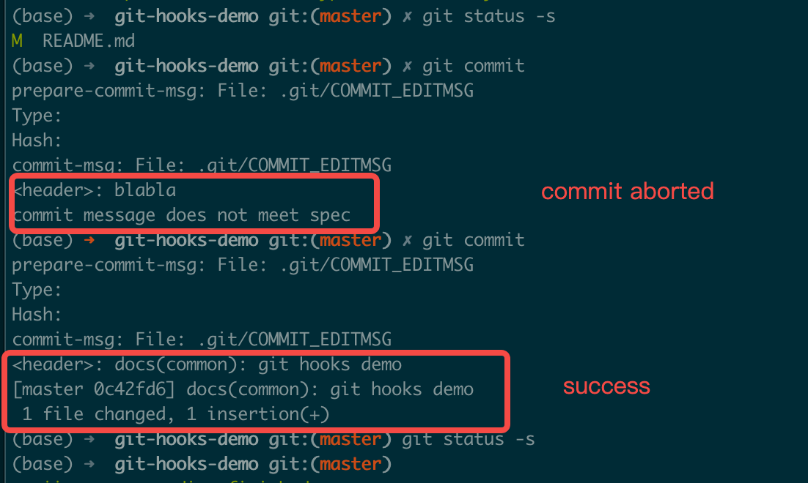

# Chapter 7: Git Commit Conventions

## 7.0 Introduction

Git is an essential skill for programmers today, used to manage code, documentation, blogs, and even recipes. While commits to personal private repositories can be relatively casual, team development requires adherence to appropriate conventions. This article organizes some practices related to commits in Git usage for your reference.


As shown in the figure above (taken from Angular commit [970a3b5](https://github.com/angular/angular/commit/970a3b5c70fee29aa40945836ebeb464d75438e4)), a commit contains the following information:

- commit message - description of the committed content
- author & committer - the author and committer
- changed files - modified files
- hash & parent - the hash of the commit content and its position in the commit tree

## 7.1 Commit Message

The commit message describes the functional information related to the current commit, and generally can include `header`, `body`, and `footer`:

```bash
<header>
<BLANK LINE>
<body>
<BLANK LINE>
<footer>
```

A good industry reference is Angular's commit standard: [Commit Message Format](https://github.com/angular/angular/blob/master/CONTRIBUTING.md#commit)

The `header` is mandatory. Angular's officially recommended format is as follows:

```bash
<type>(<scope>): <short summary>
  │       │             │
  │       │             └─⫸ Summary in present tense. Not capitalized. No period at the end.
  │       │
  │       └─⫸ Commit Scope: animations|bazel|benchpress|common|compiler|compiler-cli|core...
  │
  └─⫸ Commit Type: build|ci|docs|feat|fix|perf|refactor|test
```

In the `<header>`, `<type>` and `<summary>` are required, while `<scope>` is optional. It is recommended that the `<header>` be kept within 50 characters.

`<type>` indicates the type of this commit, generally including the following:

- `build`: Changes related to the build system
- `ci`: Changes related to continuous integration
- `docs`: Documentation
- `feat`: New features
- `fix`: Bug fixes
- `perf`: Performance-related changes
- `refactor`: Refactoring (neither bug fixes nor new features)
- `test`: Test-related changes, including adding tests or modifying existing tests

`<scope>` indicates the scope affected by the changes. In Angular, a commit might involve scopes such as form processing, animation processing, etc. In actual work, this can be determined based on the project.

`<summary>` is a brief description of this commit, using imperative mood and present tense. For example, use `change` instead of `changed` or `changes`.

`<body>` is a more detailed description of the commit information, also using imperative mood and present tense like `<header>`. The `<body>` describes the motivation for this modification, such as why this change was introduced, what the previous logic was, what the current logic is, what impacts this change has, etc.

Finally, `<footer>` is optional and generally involves breaking changes, deprecation notices, as well as references to `GitHub issues` or `Jira tickets`, PR references, etc.

Standardized commit messages can be parsed by tools to automatically generate documentation or release logs. In some large open-source projects, manually organizing version update documentation, interface updates, and compatibility impacts is very time-consuming and labor-intensive. Using a unified standard can greatly automate this work. Of course, different projects have different requirements and format standards for commit messages, and open-source projects or company projects also have different requirements for commit messages. Generally, you need to follow the conventions of the project you're working on. More mature open-source projects can usually be found in the `README` documentation on how to contribute, or have a separate `CONTRIBUTING.md` document that specifies code style, commit methods, etc.

### 7.1.1 Automated Validation of `commit message` {#711-automated-validation-of-commit-message}

With commit message conventions in place, how do we ensure developers follow them? We can use Git's `Git Hooks` feature to validate commit messages. This article won't go into too much detail about `Git Hooks`, only providing basic explanations. For specific details, refer to the [official documentation](https://git-scm.com/book/en/v2/Customizing-Git-Git-Hooks) or [Atlassian's documentation](https://www.atlassian.com/git/tutorials/git-hooks).

In a newly initialized git project, we can find official sample scripts in the `.git/hooks` folder:

```shell
ls -l .git/hooks
total 120
-rwxr-xr-x  1 tomo  staff   478B Nov 11 20:44 applypatch-msg.sample
-rwxr-xr-x  1 tomo  staff   896B Nov 11 20:44 commit-msg.sample
-rwxr-xr-x  1 tomo  staff   4.5K Nov 11 20:44 fsmonitor-watchman.sample
-rwxr-xr-x  1 tomo  staff   189B Nov 11 20:44 post-update.sample
-rwxr-xr-x  1 tomo  staff   424B Nov 11 20:44 pre-applypatch.sample
-rwxr-xr-x  1 tomo  staff   1.6K Nov 11 20:44 pre-commit.sample
-rwxr-xr-x  1 tomo  staff   416B Nov 11 20:44 pre-merge-commit.sample
-rwxr-xr-x  1 tomo  staff   1.3K Nov 11 20:44 pre-push.sample
-rwxr-xr-x  1 tomo  staff   4.8K Nov 11 20:44 pre-rebase.sample
-rwxr-xr-x  1 tomo  staff   544B Nov 11 20:44 pre-receive.sample
-rwxr-xr-x  1 tomo  staff   1.5K Nov 11 20:44 prepare-commit-msg.sample
-rwxr-xr-x  1 tomo  staff   2.7K Nov 11 20:44 push-to-checkout.sample
-rwxr-xr-x  1 tomo  staff   3.6K Nov 11 20:44 update.sample
```

The four related to commits are:

- `pre-commit` - Executed before Git generates the `commit` object
- `prepare-commit-msg` - Executed after `pre-commit`, used to generate the default commit message. The script receives three parameters:
  1. The name of the temporary file containing the commit message
  2. The type of commit, such as `message`, `template`, `merge`, `squash`
  3. The SHA1 of the related commit, only provided when `-c`, `-C`, or `--amend` parameters are present
- `commit-msg` - Executed after the developer writes the commit message, with only the temporary filename as a parameter
- `post-commit` - Executed immediately after `commit-msg`, mainly used for notifications

We can use `prepare-commit-msg` to explain the commit message conventions and use `commit-msg` to check compliance with the conventions. A non-zero return from the script will abort the current commit.

If we want to apply a simple Angular-like `<header>` format, we can refer to the following implementation.

Here's an example of `prepare-commit-msg`:

```python
#!/usr/bin/env python

import sys, os, re
from subprocess import check_output

# Collect the parameters
commit_msg_filepath = sys.argv[1]
if len(sys.argv) > 2:
    commit_type = sys.argv[2]
else:
    commit_type = ''
if len(sys.argv) > 3:
    commit_hash = sys.argv[3]
else:
    commit_hash = ''

print("prepare-commit-msg: File: %s\nType: %s\nHash: %s" % (commit_msg_filepath, commit_type, commit_hash))

msg_spec = '''# Please use follow format
# <type>(<scope>): <short summary>
#  │       │             │
#  │       │             └─⫸ Summary in present tense. Not capitalized. No period at the end.
#  │       │
#  │       └─⫸ Commit Scope: animations|bazel|benchpress|common|compiler|compiler-cli|core
#  │
#  └─⫸ Commit Type: build|ci|docs|feat|fix|perf|refactor|test'''

with open(commit_msg_filepath, 'r+') as f:
    f.write("\n" + msg_spec)

sys.exit(0)  # return non-zero will abort current commit
```

Here's a simple example of `commit-msg`:

```python
#!/usr/bin/env python

import sys, os, re
# Collect the parameters
commit_msg_filepath = sys.argv[1]
print("commit-msg: File: %s" % commit_msg_filepath)

header_pattern = re.compile(r'^(?P<type>\w+)(\((?P<scope>\w+)\))?: .+$')
commit_types = 'build|ci|docs|feat|fix|perf|refactor|test'.split('|')
commit_scopes = 'animations|bazel|benchpress|common|compiler|compiler-cli|core'.split('|')

with open(commit_msg_filepath, 'r') as f:
    commit_msg_header = f.readline().rstrip('\n')  # header line
    print('<header>: %s' % commit_msg_header)
    match = header_pattern.match(commit_msg_header)
    if not match:
        print('commit message does not meet spec')
        sys.exit(1)
    commit_type = match.group('type')
    commit_scope = match.group('scope')
    if commit_type not in commit_types:
        print('invalid <type>')
        sys.exit(1)
    if commit_scope and commit_scope not in commit_scopes:  # scope is optional
        print('invalid <scope>')
        sys.exit(1)

sys.exit(0)
```

To use the related `Git Hooks`, create corresponding files in the `.git/hooks` directory with the names `prepare-commit-msg` and `commit-msg`, and grant them executable permissions. This way, when we perform a `git commit` operation, the corresponding scripts will be executed.

The figure below shows the execution diagram, where non-compliant commits will be aborted.



For the specific execution process, refer to [online execution process](https://asciinema.org/a/dEQHRiP9r6vjaSoSUlD9Sn1nn)

Git commits do not include the `.git` directory, so changes to the corresponding `hooks` will not be committed to the repository. We can create a `.githooks` folder in the repository root directory and place our implemented code in that directory, referencing it through configuration changes or symbolic links:

```shell
# use config
git config core.hooksPath .githooks
# OR use soft link
ln -sf .githooks/* .git/hooks
```

Of course, these are all client-side validations, and developers can completely ignore such `Git Hooks` configurations and introduce non-compliant commits. In this case, we can use server-side validation, or introduce some CI tools or use GitHub Actions for validation.

## 7.2 Author & Committer

In Git, Author represents the original author who wrote the commit, and Committer represents the person who applied the commit, such as a project administrator merging a `Pull Request`. If you're an individual developer or only use a single Git platform service (such as GitHub, BitBucket, etc.), you generally don't need to configure the author specifically. However, if you use multiple Git platforms or have internal company requirements, you may need to set different users and emails for different repositories, such as setting your personal GitHub account globally and setting your enterprise email for internal company repositories.

```shell
# Global default configuration
git config --global user.email "<github email>"
git config --global user.name "<github username>"
# Enterprise internal repository
git config user.email "<enterprise email>"
git config user.name "<real name>"
```

## 7.3 Changed Files

The core of all our commits is actually the files we commit. Different commits can involve varying numbers of files. Generally, follow these principles:

- Before committing, use `git diff` to view file changes, use `git add` to add files you want to include in the commit, use `git status` to check file status, and finally use `git commit` to commit
- A single commit should only include related changes. For example, fixing two different bugs should use two separate commits
- Encourage frequent commits, which allows for faster sharing of implemented features and reduces the risk of code loss
- Half-finished work should not be committed to the main branch or collaborative feature branches. Commits must be tested before submission
- Build outputs, logs, intermediate artifacts, etc., should not be included in commits. Use `.gitignore` to exclude related files. Different languages or operating systems have some common exclusion configurations, refer to [github/gitignore](https://github.com/github/gitignore)
- Passwords, authorization credentials, keys, etc., **must not be committed**. For example, AWS certificate.csv files or contents, GCP Service Account files, etc. Leaking to public repositories will result in resources being used by malicious actors, causing losses. Also, due to Git's characteristics, removing such files from historical commits will be quite difficult, refer to [GitHub's official documentation and description](https://docs.github.com/en/authentication/keeping-your-account-and-data-secure/removing-sensitive-data-from-a-repository)
- For configuration files (such as database connection information, etc.), generally use configuration templates, maintain local files individually, and configure the file in `.gitignore`. Or use `git update-index --[no-]assume-unchanged <file>` to ignore changes to certain files
- Other commonly used commands (please use after clearly understanding their meaning)
  - `git reset <file>` - Remove added files (before commit). For other uses of the `reset` command, check the help documentation
  - `git clean -f` - Remove many untracked intermediate files
  - `git checkout <file>` - Revert changes to a file (before commit)

## 7.4 Hash & Parent

In general, we don't need to pay extra attention to `commit hash` and parent node information, but in specific scenarios we may need to fix or otherwise process `commits`. In such scenarios, we need to understand the entire git commit chain, the parent node corresponding to each commit, the common ancestor between branches, and the differences between local and remote, especially when involving `rebase` related operations. At the same time, we need to follow the workflow model used by the project throughout the entire commit process, using the operations recommended in the corresponding workflow model (for common workflow models, refer to [Atlassian documentation](https://www.atlassian.com/git/tutorials/comparing-workflows)).

Here are some scenarios involved in actual development:

- In your own development branch, a feature involves multiple commits. Before formally merging to the main branch, organize the related commits using the `git rebase -i <commit>` command to merge, discard, modify commit messages, etc. Note that if the commits have already been published to the remote, you need to use `git push -f` to overwrite (only for personal development branches). Below is a simple example and related command descriptions. Common commands include `pick`, `reword`, `fixup`, `drop`, etc.

```bash
$ git rebase -i 8717c71fc
reword 27e67629b feat: some feature first commit
fixup 7a3f0cd25 feat: some feature second commit
fixup d9a9d7f04 feat: some feature third commit

# Rebase 8717c71fc..d9a9d7f04 onto 8717c71fc (3 commands)
#
# Commands:
# p, pick <commit> = use commit
# r, reword <commit> = use commit, but edit the commit message
# e, edit <commit> = use commit, but stop for amending
# s, squash <commit> = use commit, but meld into previous commit
# f, fixup [-C | -c] <commit> = like "squash" but keep only the previous
#                    commit's log message, unless -C is used, in which case
#                    keep only this commit's message; -c is same as -C but
#                    opens the editor
# x, exec <command> = run command (the rest of the line) using shell
# b, break = stop here (continue rebase later with 'git rebase --continue')
# d, drop <commit> = remove commit
# l, label <label> = label current HEAD with a name
# t, reset <label> = reset HEAD to a label
# m, merge [-C <commit> | -c <commit>] <label> [# <oneline>]
# .       create a merge commit using the original merge commit's
# .       message (or the oneline, if no original merge commit was
# .       specified); use -c <commit> to reword the commit message
#
# These lines can be re-ordered; they are executed from top to bottom.
#
# If you remove a line here THAT COMMIT WILL BE LOST.
#
# However, if you remove everything, the rebase will be aborted.
```

- In some Git workflow models, use `git pull --rebase` to update local commits
- In principle, `git push -f` operations on the main branch are prohibited. For rollbacks that need to be made, use `git revert <commit>`
- For multi-branch code synchronization, you can use the `git cherry-pick` command

## 7.5 Exercise

Based on the [7.1.1 Automated Validation of commit message](#711-automated-validation-of-commit-message) solution in the course, implement the `git-hook` for the commit message specification in [README.md](https://github.com/datawhalechina/faster-git/blob/main/README.md#commit-message).