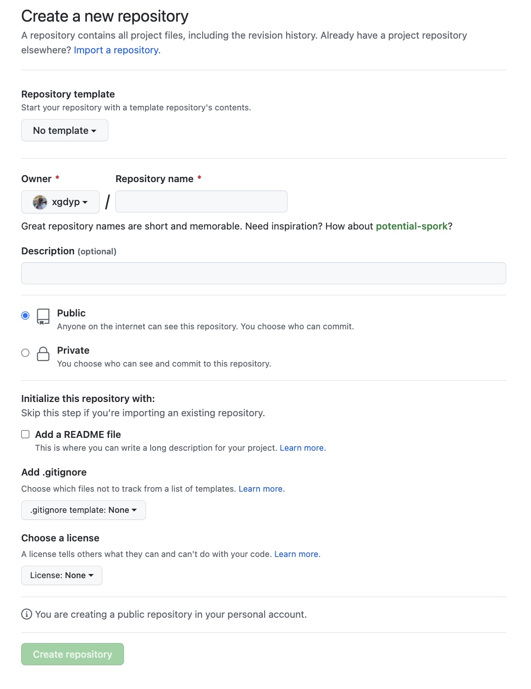
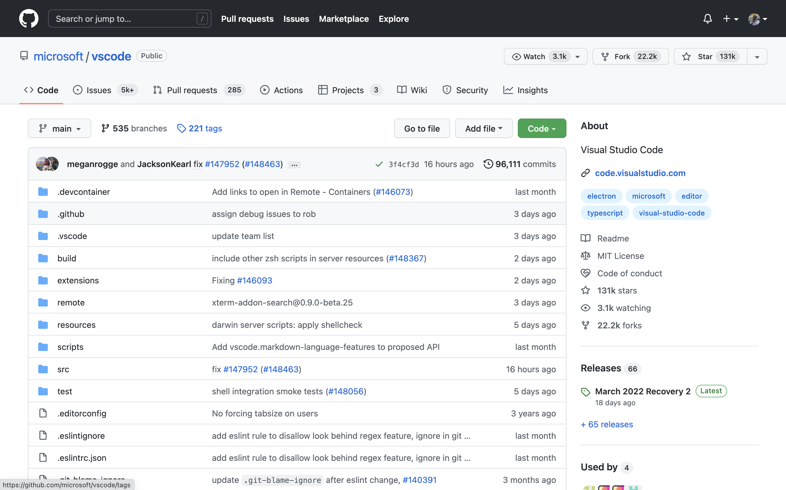
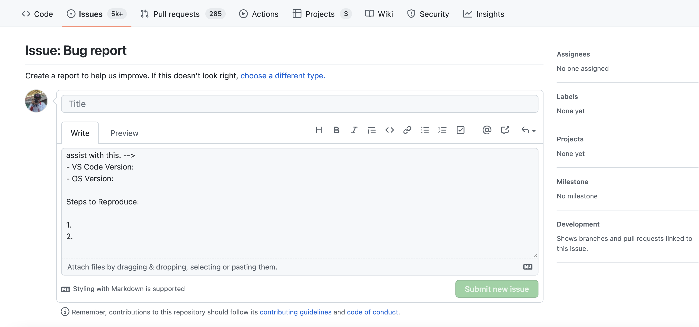
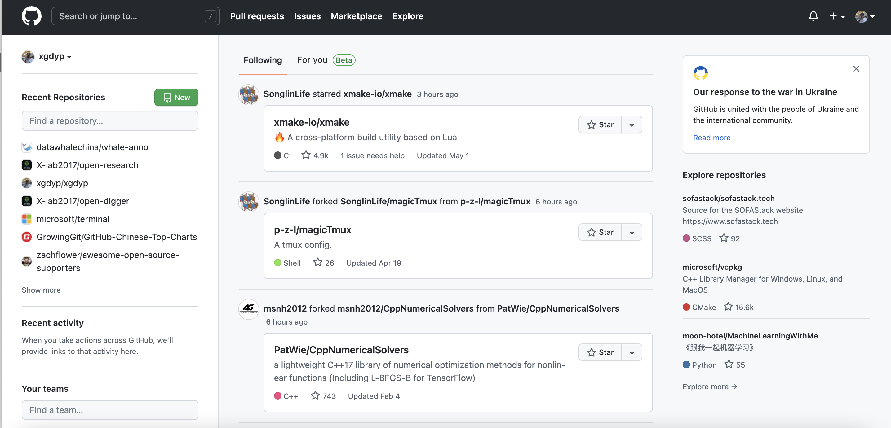
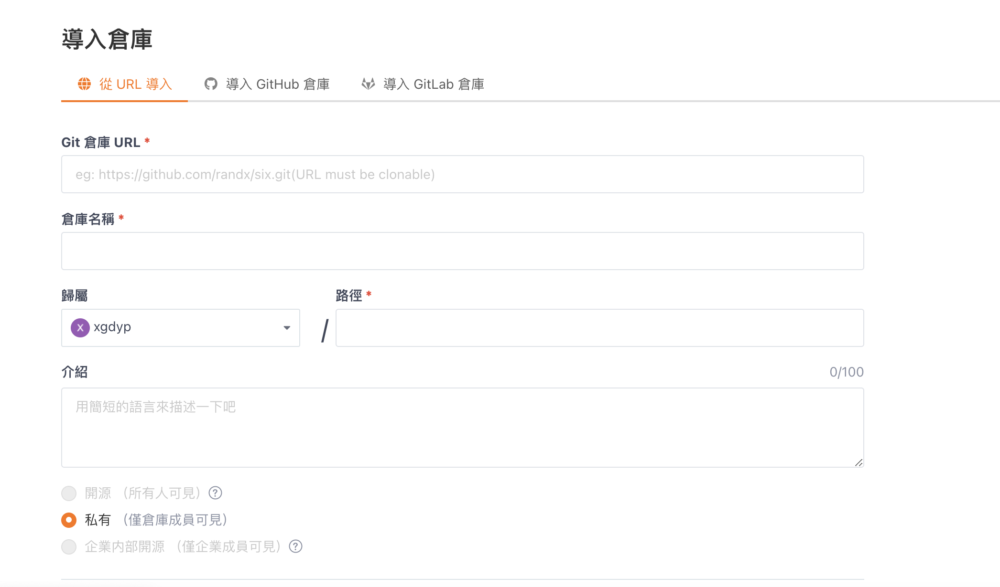

# Chapter 8 GitHub/Gitee User Guide

## 8.0 Introduction to GitHub

You may have heard of GitHub to some extent. GitHub is a code hosting platform that uses Git as its version control tool. Due to its large user base and friendly atmosphere, it is often jokingly referred to as "the world's largest social networking platform for developers." In fact, relying on Git's powerful collaboration capabilities, GitHub is one of the main battlegrounds for open-source software development. If you haven't registered for GitHub yet, you can visit <http://github.com> to create an account.

## 8.1 Using GitHub to Host Code

### 8.1.1 Creating a Repository

Almost everything on GitHub revolves around repositories. Let's first learn how to create a new repository to meet your development needs.

A GitHub repository is essentially a folder that contains all the files for your project. The .git folder is also included for version control.

Log in to the GitHub homepage and click the + icon in the upper right corner to create a repository, as shown below:


After clicking, you will be redirected to the new repository form:



Note:

1. Repositories on GitHub generally include a README file, which will be displayed on the project page
2. The .gitignore file can be used to ignore private files in the working directory (such as local configurations, cache files, node_modules, etc.)


Click the green "code" button and select the appropriate protocol to get the project's address. Locally, you just need to clone it to start development. After development is complete, push it back to the original repository.

### 8.1.2 Repository Interface Introduction

We'll use the VSCode project as an example for introduction.

Visit <https://github.com/microsoft/vscode> to see the following interface:



The page contains a lot of information. We'll mainly introduce a few key elements:

**Upper left corner of the page:**

**Star**: Star is similar to a "like" on social media. Starring a project represents your recognition of the project.

> So try not to ask friends to star your projects like collecting likes on social media.

**Fork**: The Fork operation actually creates a copy of a repository and points the repository's upstream to the original repository.

> Small question: Why fork? Why not push directly?
>
> Fork facilitates multi-person collaboration.

**Watch**: The Watch operation can push notification information about the repository to your email.


> Tip: If it's not a particularly important project, don't click Watch casually, otherwise your inbox may get bombarded.

**Issues**: Issues are translated as "issues" in GitHub's official documentation. Their purpose is to discuss the content of the repository (such as bug reports/new feature recommendations).

> Tip: Issues are not equivalent to a comment section. The Issues section should focus on solving problems. Don't post content unrelated to the project in Issues, as this may consume a lot of the maintainer's energy.

**Pull Requests**: Pull Requests, abbreviated as PR, is the operation in GitHub to merge a modified code branch into the target branch. In our previous Git learning, we know that commit is Git's smallest working unit. In GitHub repositories, PR is the main working unit. Many students are confused about Pull Requests when they first encounter GitHub: What is a pull request? In GitLab, the PR operation is called Merge Request. Actually, you can understand PR as "I've finished modifying your code, now I'm requesting you to pull the code back into the main repository."

**Action**: GitHub Action is an automated build tool launched by GitHub. Interested students can read the documentation.

**Projects**: Project board (Kanban) for a specific repository.

**Wiki**: Stores some introductory content.

**Security**: Related to security, not introduced here.

**Insights**: Contains some data about the project, including time distribution charts of code contributions, each person's contribution amount, and other metrics.

**Discussion**: The VSCode repository doesn't have the discussion feature enabled. Here's an example from the Wagtail community. This feature works like a real discussion forum.


## 8.2 Submitting an Issue

We'll use VSCode as an example to demonstrate submitting an issue.


Enter the Issues tab, and you can see that the VSCode project has prepared some templates. Let's click on Bug report.



> Tip: When reporting a bug, please describe the steps to reproduce the bug and the environment in which it runs as detailed as possible (<https://stackoverflow.com/help/minimal-reproducible-example>). Generally speaking, Issues are the starting point for participating in project contributions. A high-quality Issue will also make maintainers more willing to communicate and handle it.

If you are the project maintainer, you can also make more detailed settings for the issue on the right side. We won't go into detail here.

## 8.3 Submitting a PR

If you have forked a project's code and made modifications, and you want to merge the modified code into the upstream repository, you can submit a PR.


The image above shows VSCode's PR interface. Click "New pull request" to create a new PR. The specific PR process won't be explained in detail here.

Note: Not all PRs will be merged, so please communicate with the maintainer before submitting a PR and provide feedback on progress during development. A good approach is to use a draft PR, as shown below:


A draft PR indicates that the PR is not yet complete. The project maintainer doesn't need to review and merge it, just briefly check if the code meets expectations.

> Small tip: When submitting a PR, try to associate related Issues and explain what problem your code solves.

**Updating a Forked Project - Fetch Upstream**

Scenario: User 2729956566 forked a project, the submitted PR was approved, or the project had other updates. At this point, our forked project is no longer the latest version, so we need to update our forked project to the latest version.

General steps [Video reference link](https://www.bilibili.com/video/BV1Vb411A7z2?spm_id_from=333.337.search-card.all.click)

```shell
# Check how many branches the remote repository has
git remote -v

# Add the original repository address
git remote add upstream git@github.com:2951121599/repo_for_test_pr.git

# Check the remote repository branches again (there will be an additional upstream repository)
git remote -v

# Fetch pulls the remote branch to local. pull = fetch + merge (pull does automatic merging)
# Create a new branch master/upstream
git fetch upstream

# View remote branches. If the name is the same as the local branch, then do a merge
git branch -r

# Keep consistent with the original repository's remote. Rebase doesn't do merge operations, it copies the current branch's modifications and places them after the last commit of the target branch, while merge combines two branches together
# So if you haven't made contributions, rebase is enough
git rebase upstream/master

# Push
git push
```

## 8.4 Exploring GitHub

For most programmers, an important use of GitHub is to learn from others' code and see if there are ready-made solutions for their tasks. Therefore, how to efficiently explore GitHub is also very important. Here are some tips for exploring GitHub.

### 8.4.1 Explore

Click Explore at the top of GitHub or enter <https://github.com/explore>. The Explore section not only recommends projects based on your interests, but the Trending list also shows the projects with the highest current comprehensive popularity. Following Trending allows you to keep up with the latest trends across GitHub.


> Supplement: <https://kamranahmed.info/githunt/> is also a website for tracking popular projects.

### 8.4.2 Keyboard Shortcuts

The GitHub website has a series of keyboard shortcuts that allow you to complete actions you want to perform. For example, Ctrl/Command+K brings up a search box similar to PowerToys, where you can search directly.


There are many similar shortcuts. For a complete list of shortcuts, see the documentation: <https://docs.github.com/en/get-started/using-github/keyboard-shortcuts>

### 8.4.3 Advanced Search

Efficient search methods can save you a lot of time. For example, the following code can help you find projects on GitHub with more than 10,000 stars:

```bash
stars:>10000
```


For other search tips, refer to the link in the red box in the image above.

**Quick Cheat Sheet for Common Searches**

#### 8.4.3.1 Basic Search

| Search                  | Find repositories using...                                    |
| ----------------------- | ------------------------------------------------------------- |
| cat stars:>100          | Find cat repositories with more than 100 stars.               |
| user:2951121599         | Get all repositories from user 2951121599.                    |
| qucik_sort extension:py | Find all instances of qucik_sort in code with py extension.   |
| NOT cat                 | Exclude all results containing cat.                           |

#### 8.4.3.2 Repository Search

View projects you have access to on GitHub, and you can also filter results.

| Search                   | Find repositories using...                                    |
| ------------------------ | ------------------------------------------------------------- |
| python forks:>200        | Find all Python repositories with more than 200 forks.        |
| awesome-python fork:true | Include forks of awesome-python.                              |
| awesome-python fork:only | Return only forks of awesome-python.                          |

#### 8.4.3.3 Code Search

Code search looks at files hosted on GitHub. You can also filter results:

| Search                      | Find repositories using...                                           |
| --------------------------- | -------------------------------------------------------------------- |
| chunk repo:2951121599/Utils | Find all code instances of chunk from repository 2951121599/Utils.   |
| pandas user:2951121599      | Find references to pandas from all public 2951121599 repositories.   |
| examples path:/docs/        | Find all examples in path /docs/.                                    |

#### 8.4.3.4 Issue Search

Issue search looks at issues and pull requests on GitHub. You can also filter results:

| Search               | Find issues...                         |
| -------------------- | -------------------------------------- |
| cat is:open          | Find open cat issues.                  |
| strange comments:>42 | Issues with more than 42 comments.     |
| hard label:bug       | Hard issues labeled as bugs.           |
| author:2951121599    | All issues authored by 2951121599.     |
| mentions:tpope       | All issues mentioning tpope.           |
| assignee:2951121599  | All issues assigned to 2951121599.     |

### 8.4.4 CodeSpace

In your repository interface, press `.` (period key in English input mode) to enter the project's web editor. This is essentially a cloud-based VSCode, making it convenient for users to search and edit code. Unfortunately, CodeSpace cannot support running code online yet. Some simple modifications can be used in combination with Actions.

### 8.4.5 Copilot

Copilot is a powerful code completion tool trained by GitHub using public code. It is still in the beta testing phase. Interested students can apply at <https://copilot.github.com/>. We won't introduce it in detail here.

### 8.4.6 Readme-profile

User homepages are also a great place to explore GitHub. My user homepage is shown below:



The left side shows projects you've participated in, the right side shows projects recommended by GitHub Explore, and the middle shows recent activities of users you follow. Generally speaking, the more users you follow, the more exciting your homepage feed will be.

> Supplementary material: SegmentFault made a list of Chinese open-source enthusiasts this year. Interested students can check it out: <https://github.com/OpenSourceWin/hacking-force>

### 8.4.7 GitHub API

GitHub provides a series of APIs for developers. For details, see <https://docs.github.com/en/developers>. Through APIs, you can collect and analyze data and explore GitHub at a more microscopic level. There are also open-source projects specifically doing this, such as the open-digger open-source project (<https://github.com/X-lab2017/open-digger>). Interested students can explore it themselves. We won't elaborate here.

### 8.4.8 Stay Alert, Stay Just

GitHub is not a lawless place. If you encounter code abuse or political/religious discrimination, please report it without hesitation!

> **Exercise 1** (Optional): GitHub readme-profile practice
>
> Readme-profile is a homepage display repository provided by GitHub. The specific implementation method is to create a repository with the same name as your username. This repository can be displayed in your GitHub profile. At the same time, you can also add various badges to make your homepage look very cool.
>
> Some resources for reference:
>
> <https://github.com/rzashakeri/beautify-github-profile>
>
> <https://github.com/kautukkundan/Awesome-Profile-README-templates>

> **Exercise 2** (Optional): PR practice within groups
>
> Establish a learning repository as a group, and each person submits a PR to the repository and merges it into the main branch.

## 8.5 Brief Introduction to Other Domestic Code Hosting Platforms

Gitee/Coding/jihulab

As a code hosting platform, GitHub may be slow to access due to network speed and other limitations. You can use the open-source project [dotnetcore/FastGithub: GitHub acceleration tool](https://github.com/dotnetcore/FastGithub). Just download, install, and run it to improve website access speed.

In this case, you can use domestic code hosting platforms. Here we only introduce Gitee.

Website: <https://gitee.com/>

Gitee's overall functionality is not much different from GitHub. We won't introduce it in detail here, waiting for everyone to explore.

Below we'll explain how to clone projects from GitHub through Gitee.

When creating a repository on Gitee, click "Import" in the upper right corner:



You can then import projects from other platforms and enjoy high-speed cloning. Very convenient!

If you want to push code back to GitHub, please review the knowledge related to git remote to perform the operation.

----

This concludes the content of this chapter. Below are some supplementary materials:

Supplementary Material 1: Some Git-related open-source repositories

Progit2: <https://github.com/progit/progit2>

git-cheat-sheet: <https://github.com/arslanbilal/git-cheat-sheet>

githug - A Git practice game written in Ruby: <https://github.com/Gazler/githug>

gitignore templates: <https://github.com/github/gitignore>

git-extras: <https://github.com/tj/git-extras>

git-recipes: <https://github.com/geeeeeeeeek/git-recipes>

Supplementary Material 2: Recommended High-Star GitHub Projects

Awesome series:

Main repository: <https://github.com/sindresorhus/awesome>

Weekly series:

<https://github.com/GrowingGit/GitHub-Chinese-Top-Charts>

<https://github.com/ruanyf/weekly>

<https://github.com/GitHubDaily/GitHubDaily>

Resource collection series:

<https://github.com/papers-we-love/papers-we-love>

<https://github.com/public-apis/public-apis>

<https://github.com/danistefanovic/build-your-own-x>

<https://github.com/GorvGoyl/Clone-Wars>

<https://github.com/TheAlgorithms>

This is only a small portion of the projects listed. Interested students can communicate in the study group!
