# 第九章 Git 图形工具

> Author：shenhao

## 9.0 前言：为什么要使用 Git GUI ？

Git 虽然作为一个开源的分布式版本控制系统，可以有效、高速地处理从很小到非常大的项目版本管理，但在实际项目研发过程中，开发人员通常只会使用几个常见的命令进行协同工作。从之前的章节，我们已经深入了解到了 Git 的基本原理和众多命令，有些命令由于不常使用，较难记忆。因此，对于多数项目开发者而言，在终端上运行的纯文本命令并不是最佳的选择；有时候可视化图形界面更符合用户的习惯。Git GUI 为用户提供了一个可视化的图形界面，允许项目开发者通过简单的点击便捷地使用 Git，从而不需要在终端上手动输入繁多的文本命令。这样一来，开发者能够更高效、更便捷地进行项目版本管理。

本章将介绍以下三种主流的 Git GUI 图形化工具，帮助开发者能更为轻松、高效的利用 Git 进行项目版本管理。

- **GitHub Desktop**
- **TortoiseGit**
- **Vscode Git**

在本教程中，只介绍了部分 Git GUI 图形客户端， 更多详细内容可以查看✅[Git 官网](https://git-scm.com/downloads/guis/)。

## 9.1 GitHub Desktop

[GitHub Desktop](https://desktop.github.com/) 可能是所有 Git 可视化应用中最著名的方案。几乎所有开发人员都熟悉 GitHub ，而 Github Desktop 正是 Github 推出的开源 Git GUI 图形客户端。可以在 Windows 和 Macos 平台上进行使用，目前暂不支持 Linux 平台。

### 9.1.1 基本使用

首先进入官网，根据不同的系统，下载并安装对应版本的 [GitHub Desktop](https://desktop.github.com/) 。

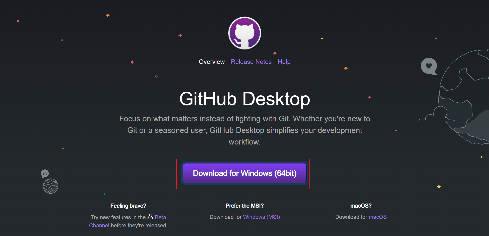

#### 9.1.1.1 登录

完成下载后，第一次打开软件会直接要求登录个人 Github 账户进行授权，并配置用户名和邮箱（识别个人创建的 commits 提交）。

如果没有找到让你登录 GitHub 账号的地方，你需要在 File -> Options -> Accounts -> Sign in 登录。

在完成基本配置后，会出现如下界面：

#### 9.1.1.2 建立首个仓库

初次登陆会看到三个选项，也就是建立自己的第一个 repository。

建立一个 repo 可以通过三个方式：

- clone a repository：克隆一个 repo
- create new repository：建立一个新的 repo
- add a local repository：添加一个本地的 repo

我们先选择从 URL 中克隆 [faster-git](https://github.com/datawhalechina/faster-git) 仓库，如下图，需要修改的地方为 URL 链接以及本地存储的路径。

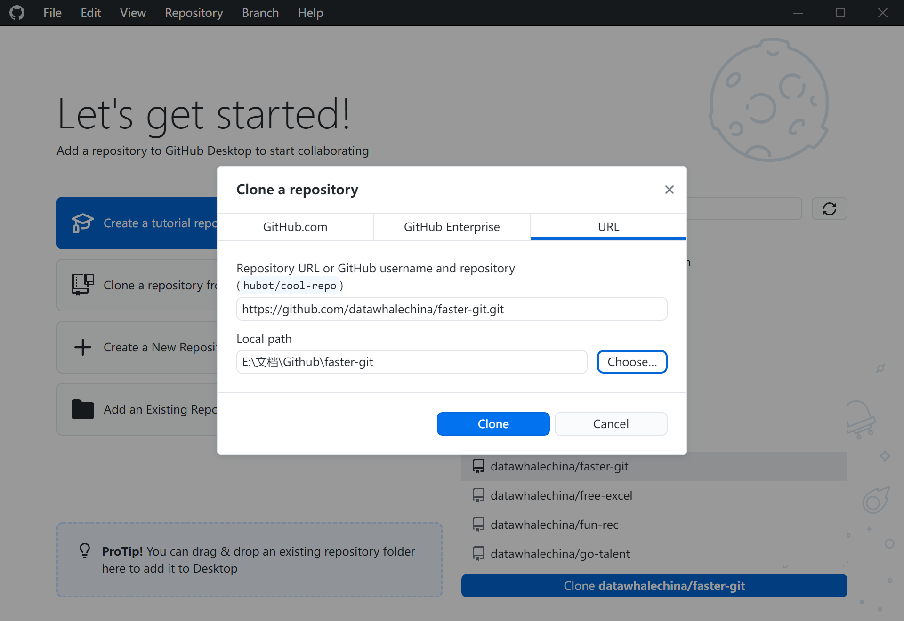

#### 9.1.1.3 提交 Pull Request

##### fork

由于在实际开源项目贡献的过程中，开发者往往并没有直接修改仓库内容的权限，因此需要先对目标仓库进行 fork 操作，再通过提交 PR 的方式进行代码的贡献。在下图中，可以通过左下角的 warning 标志⚠，判断用户是否有目标仓库的权限。如果没有写入权限，点击 create a fork，将目标仓库复刻为自己的仓库，进行随意的修改。

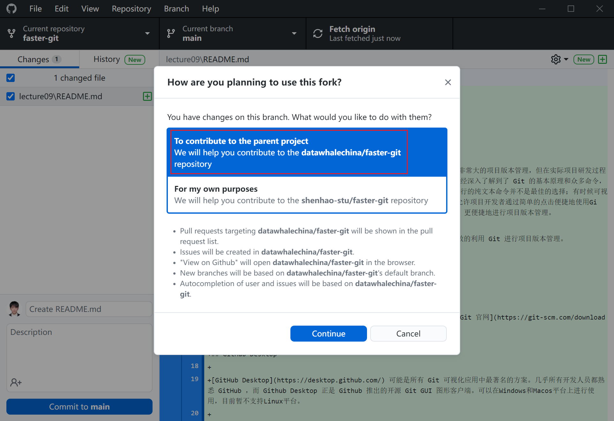

在 Github Desktop 中完成 fork 后，登录 Github 网页就可以在个人仓库中看到目标仓库的复刻版，如下所示。

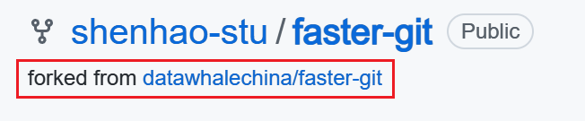

##### commit & push

在完成了 fork 后，当前仓库就会索引到用户个人的复刻仓库，对应于本地指定目录下的文件。此时，用户拥有复刻仓库的所有权限，包括修改，删除，更改可视状态等等。接下来，就可以对本地分支中的代码进行修改，更新而当操作，再 push 到用户个人的复刻仓库中。

此时，登录 Github 网页版就会发现本地修改的代码已经上传到云端，个人复刻仓库进行了本地同步。

##### PR

在完成个人仓库的代码更新后，还要注意个人仓库的分支和目标分支的先后情况，如果目标分支领先于 fork 分支，需要先通过 fetch upstream 操作进行更新后，再提交 PR。

> **upstream**分支指向上游地址即目标分支，这里的**upstream**名字可以任意指定，只是一般都把上游地址都叫**upstream**。

点击 Contribute，并 Open pull request，向目标仓库提交上传申请。

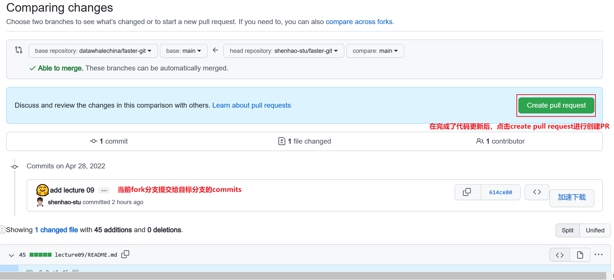

在完成 PR 后，会自动跳转到目标仓库，可以看到在 Pull requests 一栏中，上标增加了 1，1 就是贡献者所提交 PR。之后就需要目标仓库的拥有者对贡献的代码进行审阅，如果代码合规可利用，就会将 fork 分支的 commits 合并到主分支中。这样一来，就完成了一次贡献！！👏👏

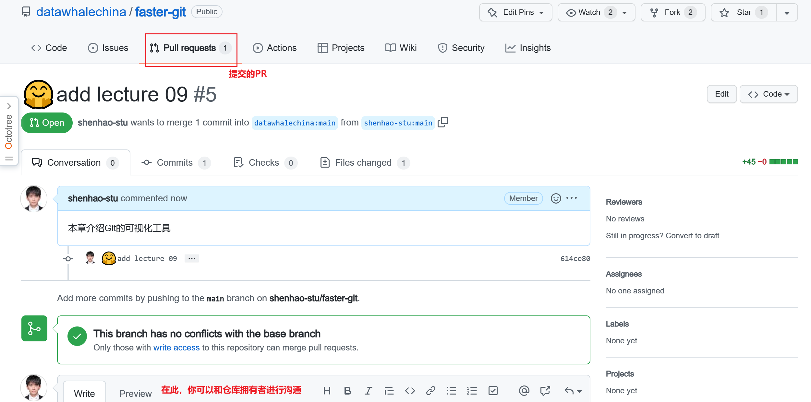

## 9.2 TortoiseGit

TortoiseGit 简称 tgit， 中文名海龟 Git ，是一个开放的 Windows 系统下的 Git 版本控制系统的源客户端，提供有中文版支持。由于它不是针对特定 IDE(如 Visual Studio、Eclipse 或其他) 的集成，所以可以与任何开发工具和任何类型的文件一起使用。与 Github Desktop 一类的传统图形化交互不同，与 TortoiseGit 的交互主要利用 Windows 资源管理器的上下文菜单，因此不需要打开任何软件，十分轻量、便捷。

### 9.2.1 下载

根据操作系统的位数，下载并安装对应版本的 TortoiseGit 及中文语言包（✅ TortoiseGit 及语言包 [下载](https://tortoisegit.org/download/) ，✅TortoiseGit [安装教程](https://jingyan.baidu.com/article/f3ad7d0f37a75d09c2345b6f.html)）。

### 9.2.2 安装

1、双击刚刚下载好的 msi 文件进入安装

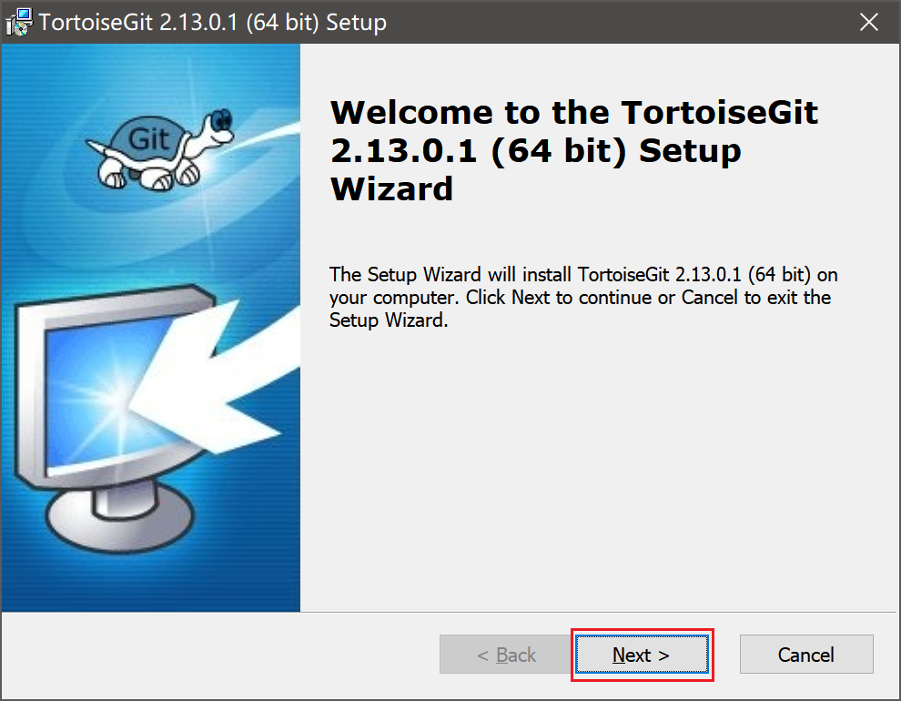

2、连续两次 next 之后，到如下页面，更改下载位置，继续 next

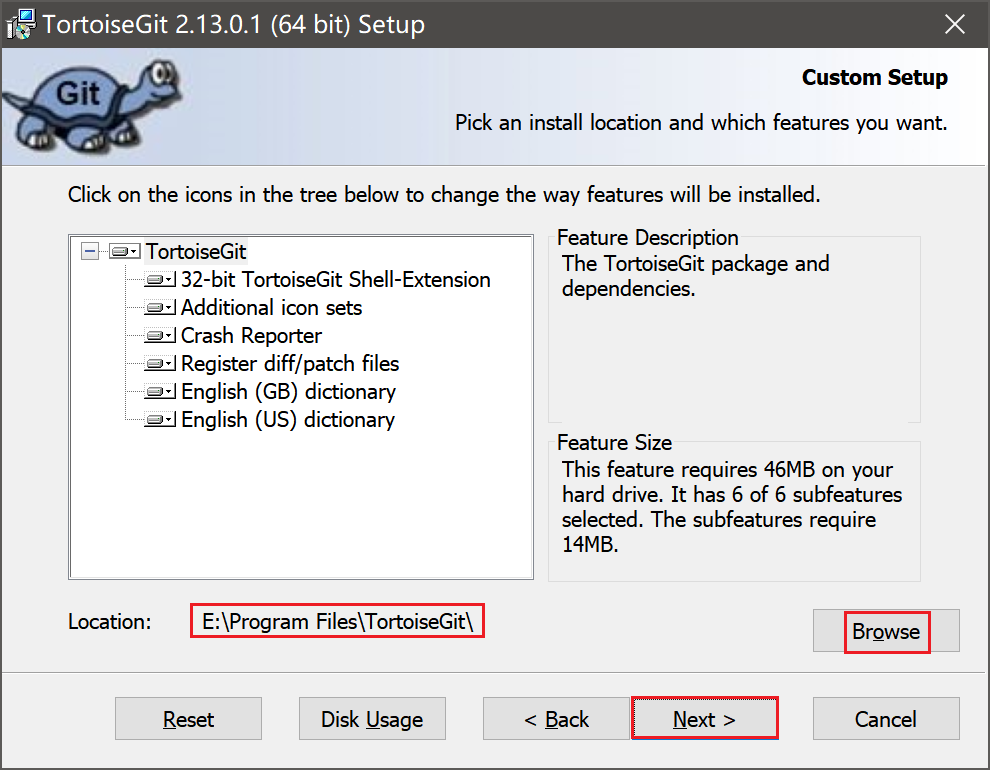

3、点击 Install 进行安装

4、点击 Finish 配置 TortoiseGit

5、选择英文进入连续两次点击下一页

6、配置 git.exe，并点击下一页

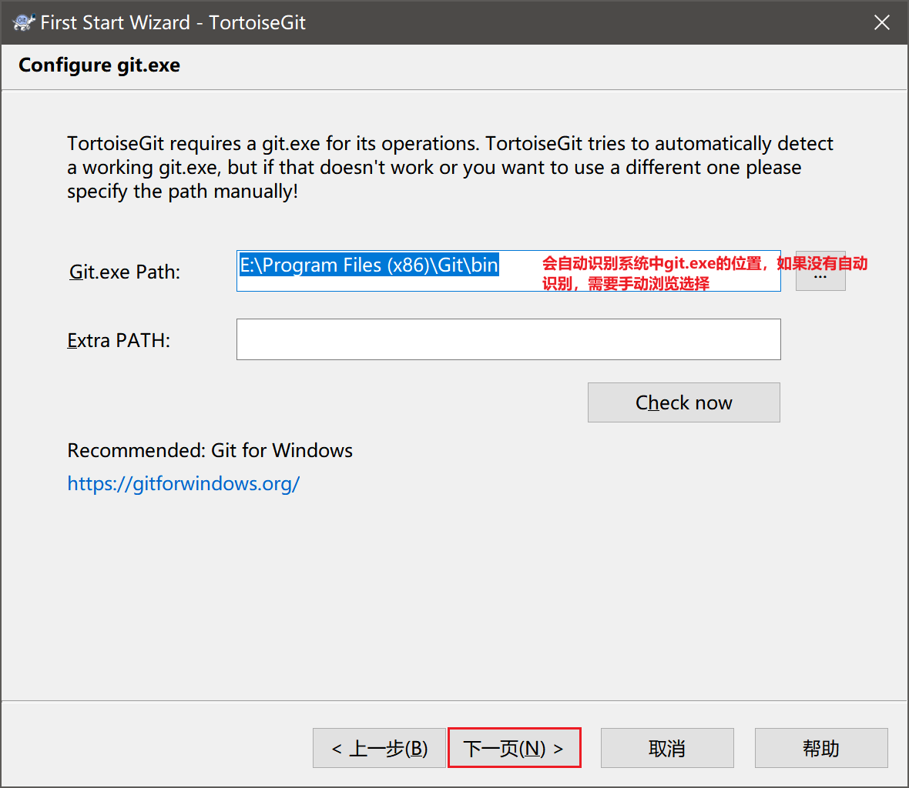

7、填写用户名和邮箱，并点击下一页

8、完成 tortoisegit 安装

9、双击 TortoiseGit-LanguagePack-64bit-zh_CN.msi，配置中文语言

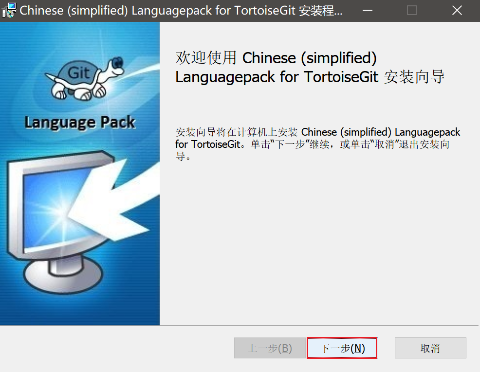

### 9.2.3 基本使用

与 Github Desktop 不同，TortoiseGit 是通过鼠标右键菜单栏的方式进行 git 命令的交互，桌面空白处右键后如下所示。

#### 9.2.3.1 建立首个仓库

本地 Git 仓库的创建有两种，一是直接 Clone 已存在的 Git 仓库，二是本地创建版本库。

##### Clone 仓库

在存放项目的目录点右键，选择 Clone，配置目标仓库的 URL 以及本地存储的路径。

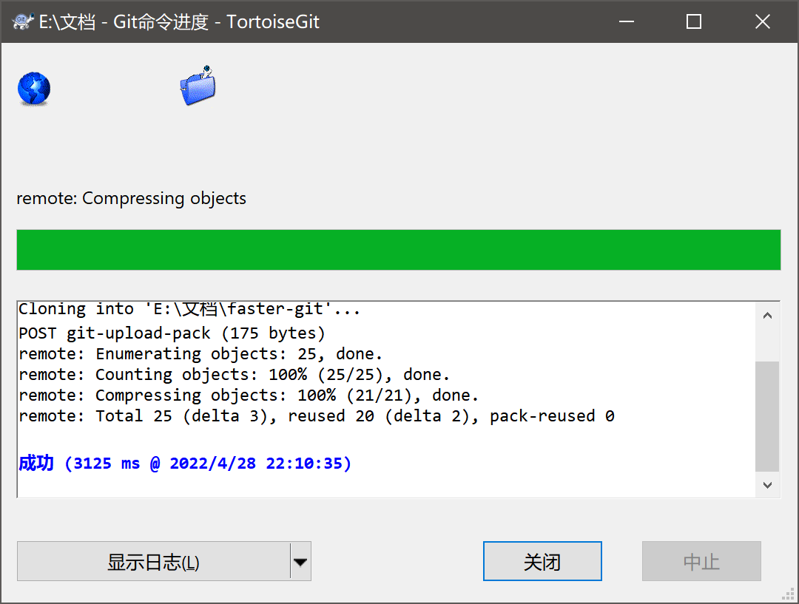

克隆成功，在文件夹上就可以看到角标标识，下图是克隆后并修改的情况：

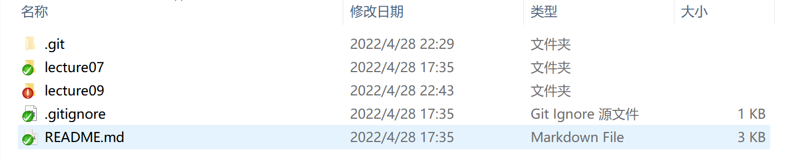

Git 文件上角标符号是用于反映出当前文件或者文件夹的状态：

1、正常的：**绿色的对号**

2、被修改过的：**红色感叹号**

3、新添加的：**蓝色的加号**

4、未受控的（无版本控制的）：**蓝色的问号**

5、忽略不受控的：**灰色的减号**

6、删除的：**红色的叉号**

7、有冲突的：**黄色的感叹号**

> 若是看不到角标符号可以查看该教程：[TortoiseGit状态图标不能正常显示的解决办法](https://www.cnblogs.com/xiesong/p/5761352.html)

##### 创建本地版本库

新建一个项目目录 myfaster-git，在代码目录右键选择创建版本库。在弹出提示中，不要勾选纯版本库，直接确定

之后项目目录下就会生成一个.git 的目录，这个目录里面记录的是 git 操作相关内容。

#### 9.2.3.2 Add & Commit & Push

在完成项目的代码更新后，可以右键选择 Git 提交进行 add、commit 以及 push 操作。

填写日志信息作为 commit 的 message，同时勾选设置作者日期以及作者，明确代码更新的细节。再在变更列表中选择需要 commit 的文件，最后点击提交并推送完成 push 操作。

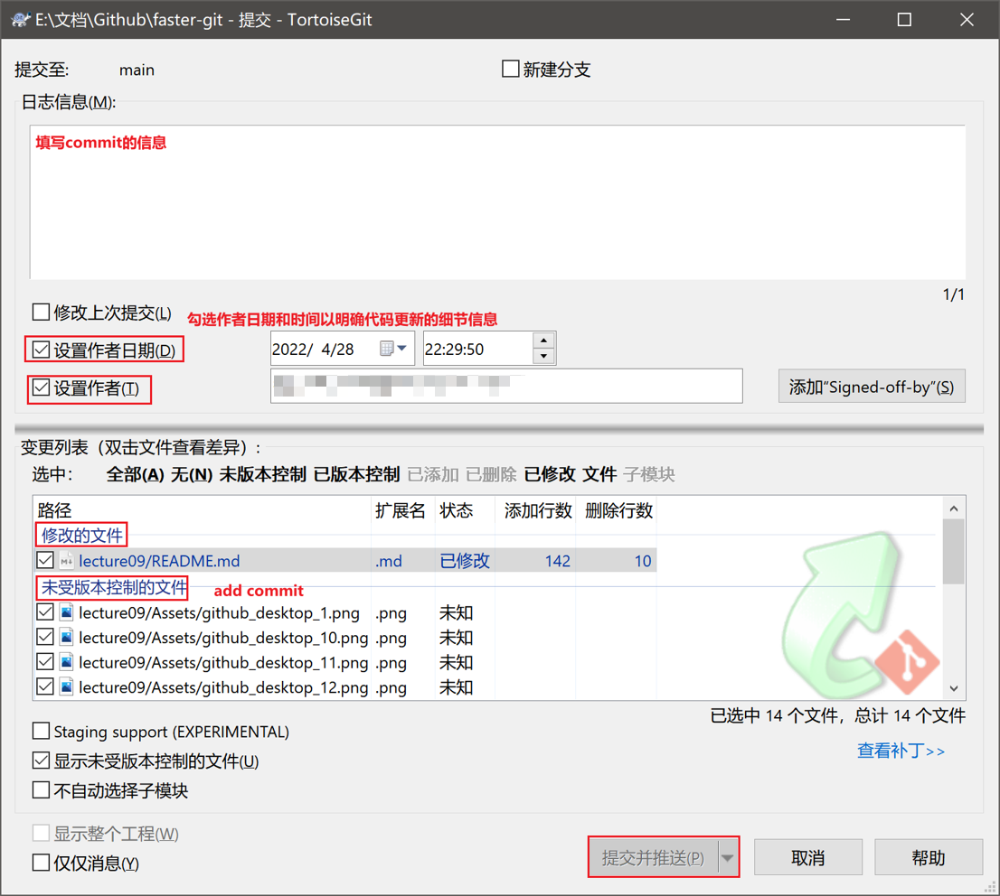

#### 9.2.3.3 Pull

当需要更新本地代码时，可以右键选择 TortoiseGit，再选择拉取进行 fetch。

> 📃注意：其余的一些 git 操作，可以在下拉框中进行操作，见上图。

#### 9.2.3.4 配置远端

右键选择 TortoiseGit，再选择设置，进入以下界面。在 Git 下的远端中，可以配置本地 main 分支所对应的远端分支，例如个人 Github 仓库的 origin 分支，或者 fork 分支的上游 upstream 分支等等。

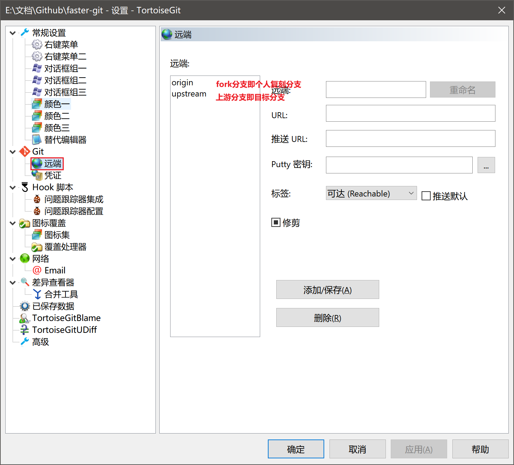

## 9.3 Vscode Git

在实际项目开发过程中，往往遇到的场景是项目开发者直接通过代码编辑器进行 Git 操作，在本章中，主要介绍 Vscode 中 Git 的一些基础的操作。

导入项目文件，选择侧边栏的第三项，就可以看到以下内容。

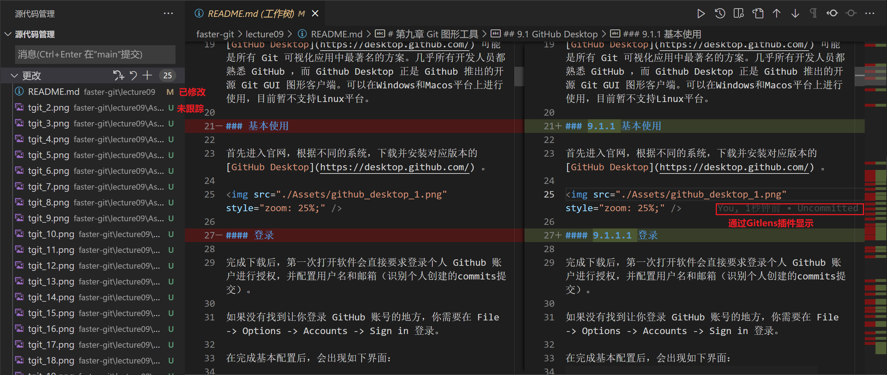

首选暂存所有更改，再在消息栏中输入 message 并点击勾进行提交，或者使用快捷键 Ctrl+Enter 进行提交。

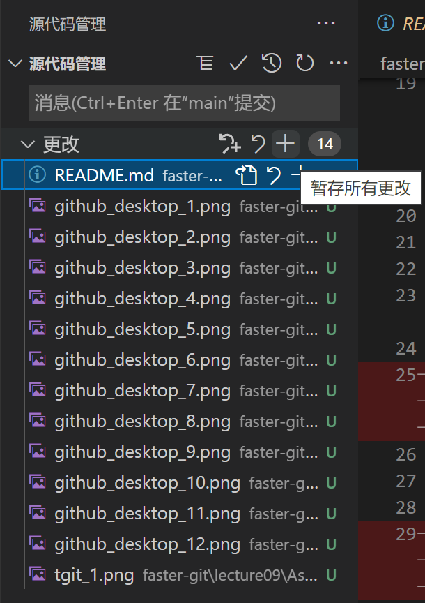

完成 add 和 commit 操作后，点击同步，即可以 push 到远端。

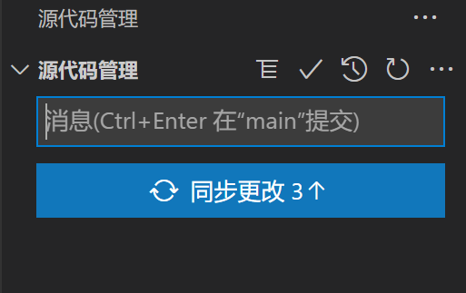

## 9.4 本章小结

在本章的前言部分，通过比较在日常应用场景下终端命令和图形化界面的优劣，引出了 Git GUI 图形化应用。再详细介绍了三种类型的 Git GUI 图形化应用，Github Desktop、TotoiseGit 以及 Vscode Git。与传统的命令行不同，图形化界面为项目开发者提供了更为轻松、高效的方式利用 Git 进行项目版本管理。在下一章中，将详细介绍 Git 团队协作以及合并时的 diff 工具。

🎉冲冲冲！！！
