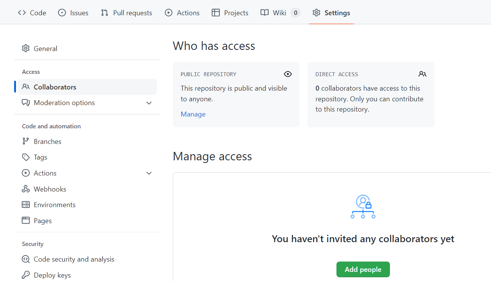
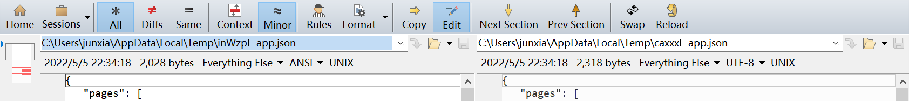

# Chapter 10: Git Team Collaboration and Diff Tools for Merging

> Author: JunXia

## 10.0 Introduction

In many multi-person team (programming) tasks, especially when cross-editing certain sections of code is required, the advantages of Git as a distributed version control system become evident. This is perhaps why many people start to learn and use Git. (The author is no exception!)

In fact, this project was also completed through such team collaboration. At the end of this project, we will briefly introduce the typical "approaches" to Git team collaboration.

[//]: # " In actual project development work, there are often multiple work stages such as self-testing, joint debugging, testing submission, and online emergency fixes, which may require code deployment in multiple environments such as local, internal testing, development, testing, and production. Each stage generates different branches; this article will start from the principles of the Git-Flow model, demonstrate practical operational methods through command-line examples and summarize them, ultimately hoping that Git-Flow can be applied in actual projects to efficiently complete code development, version management, and other practical work."

[//]: #
[//]: # "(Note: Different companies or different projects have different GitFlow workflow model standards, which should be based on actual application; this article provides a commonly used template that is relatively comprehensive and universal. It is recommended to practice more to achieve proficiency)"

## 10.1 General Methods for Pushing Code (Commits) to Remote Repositories

[//]: # " Still using the liaoxf mentioned in Chapter 3?"

### 10.1.1 Informal Commits: Adding Repository Collaborators to Gain Direct Push Permission (Advantage: More Convenient & Faster)

Taking GitHub as an example, first, the repository administrator (usually the creator or owner of the repository) clicks the `Add People` button shown in the figure below on the Settings page of the repository on GitHub to add collaborators:



Agree on a general format for Commit Messages, with words like fix, update, merge, etc. placed at the beginning of the commit message to roughly indicate the general content of this commit.

### 10.1.2 Standard Commits and Merges: Using Pull Requests (Advantage: More Rigorous & Beneficial for Controlling the Quality of Each Version. For Example, Forking Workflow)

(For a basic introduction to Pull Requests, please refer to the Pull Requests and Submitting PR entries in Chapter 8.)

This project adopts exactly this approach. More specifically, it uses the Forking workflow, which means first forking the repository to a personal account (to avoid accidental operations affecting the main branch, it is often necessary to disable direct push to the main repository, that is, disable the informal commits described in the previous section), and then submitting the forked modifications to the repository administrator for review using PR requests. After approval, they are merged into the main branch; you can refer to the [Atlassian documentation](https://www.atlassian.com/git/tutorials/comparing-workflows/forking-workflow)

In addition, such relatively formal workflows often require more rigorous commit message formats. For example, this project uses the following format for commit messages:

Commit messages use the following format: `<type>: <short summary>`

```bash
<type>: <short summary>
  │            │
  │            └─⫸ Summary in present tense. Not capitalized. No period at the end.
  │
  └─⫸ Commit Type: lecture{#NO}|others
```

`others` includes changes unrelated to the course, such as changes in this `README.md`, adjustments to `.gitignore`, etc.

In fact, some larger projects or enterprises may involve coordinating the configuration of multiple repositories and their participants' permissions, so they will use features such as Projects and Organizations.

## 10.2 Code Comparison and Conflict Resolution

What often accompanies team collaboration is the problem of merge conflicts. Chapter 3 has already mentioned some general methods for handling conflicts (such as manual modification and temporarily aborting Merge for troubleshooting). Here we introduce a famous software for code comparison—Beyond Compare (or bc for short, its official website is <https://www.scootersoftware.com/download.php>. The version used below is 4.4. Other versions may have slight differences, such as version numbers in some paths that may need minor adjustments, but the main functions are basically the same).

Using bc as a code comparison tool can be conveniently configured in git and has a relatively mature graphical interface (it can also reasonably handle line breaks CR and LF for different systems automatically). Compared with manually resolving conflicts, the efficiency is much better.

### 10.2.1 Configuring bc

After bc installation is complete:

#### Configure Directly with Git Commands

Where `C:/Program Files (x86)/Beyond Compare 4` is the default installation location for the (32-bit version of) bc4. If you customized the location during installation, you need to modify it accordingly. (In addition, since there are several escape characters with `\ ` in the code, please be careful not to delete them accidentally.)

(This is a direct global configuration for git. If you only want it to take effect in a certain code repository, you can change all the global in the following section to local.)

```shell
$ git config --global diff.tool bc4
$ git config --global difftool.bc4.cmd "\"C:/Program Files (x86)/Beyond Compare 4/BComp.exe\" \"\$LOCAL\" \"\$REMOTE\" \"\$BASE\" \"\$MERGED\""
$ git config --global difftool.bc4.trustExitCode true

$ git config --global merge.tool bc4
$ git config --global mergetool.bc4.cmd "\"C:/Program Files (x86)/Beyond Compare 4/BComp.exe\" \"\$LOCAL\" \"\$REMOTE\" \"\$BASE\" \"\$MERGED\""
$ git config --global mergetool.bc4.trustExitCode true
```

If there are no errors after entering the commands, you can skip the following section in parentheses.

#### (Or Modify the Configuration File

Open the global or local (for a specific project) configuration file. The global configuration file is generally in the user folder and can be opened with the following command:

```shell
$ cd ~
$ vim .gitconfig
```

The local configuration file is the config file in the .git directory of the local code repository folder. Of course, modifying it in local will not share this configuration in other code repository folders.

Create a new line at the end of the file, append the following configuration code, and save:

```bash
[diff]
tool = bc4
[difftool "bc4"]
cmd = \"C:/Program Files (x86)/Beyond Compare 4/BComp.exe\" \"$LOCAL\" \"$REMOTE\"
[merge]
tool = bc4
[mergetool "bc4"]
cmd = \"C:/Program Files (x86)/Beyond Compare 4/BComp.exe\" \"$LOCAL\" \"$REMOTE\" \"$BASE\" \"$MERGED\"
trustExitCode = true
```

)

### 10.2.2 Using bc

#### Scenario 1: Using in Merge

[//]: # ","

That is, "a conflict will occur when merging into the main branch" as mentioned in Chapter 3. As shown in the figure below: (At this time, a MERGING highlight prompt often appears to the right of the branch name.)


At this time, directly use the command:

```bash
$ git mergetool
```

This will directly open the bc interface:


One of bc's better features is that it converts dividing lines such as "<<<<<<", "=======", ">>>>>>" into three more intuitive complete small windows, and uses color blocks to mark and allows you to directly click to select which parts to keep. You can directly click `Next Section` and `Prev Section` to switch between various difference sections. The middle small window (the file name generally includes BASE) is the nearest common ancestor of the different versions, the left and right are the two conflicting versions, and the final effect after modification and merging is displayed in the large window in the lower half of the screen. After the final comparison and modification are completed and saved, you can directly close the window. If there is more than one file with differences, bc will automatically open subsequent files that need to be compared.

After saving is complete, continue to git bash to commit and push, and you're done!!

#### Scenario 2: As a More Intuitive Graphical Interface to Replace the Diff Command

In general situations, you can directly replace the diff command in Chapter 3 with difftool to see the content in diff status in the bc interface, as shown in the figure below:



You can still similarly click `Next Section` and `Prev Section` to switch between various difference sections and perform other modification operations.
