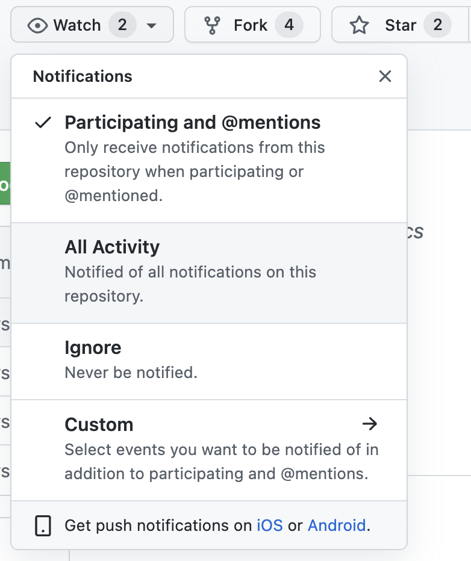
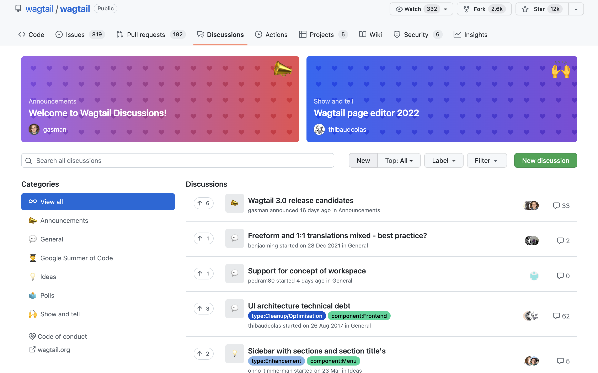
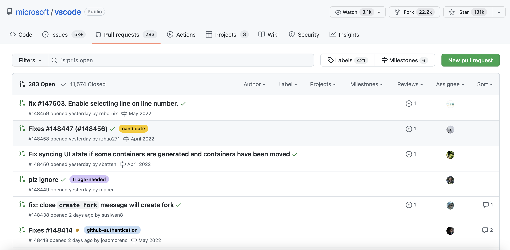
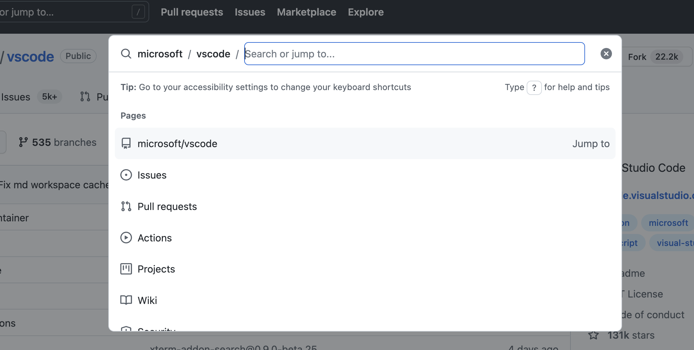

# 第八章 Github/Gitee 使用说明

## 8.0 初识 GitHub

 可能同学们都或多或少听说过 Github，Github 是一个使用 Git 作为版本管理工具的代码托管平台，由于其用户量大并且氛围友好，又经常被大家戏称为“全球最大同性交流平台”。事实上，依赖于 Git 的强大协作能力，Github 是开源软件发展的主战场之一。如果还有同学没有注册过 Github，可以先登陆<http://github.com>注册账号

## 8.1 使用 Github 托管代码

### 8.1.1 创建仓库

Github 上几乎所有的事情都是围绕着仓库展开的。我们首先来学习如何新建一个仓库并满足自己的开发需求。

一个 GitHub 仓库实质上是一个包含了你的项目所有文件的文件夹。 .git 文件夹也包含在其中用于版本控制。

登陆 GitHub 主页，点击右上角 + 号即可创建一个仓库，如下图：


点击后会跳转到新建仓库的表单，


注意：

1. github 上的仓库一般都会包含 readme 文件，该 readme 文件会在项目页面进行展示
2. .gitignore 文件可以用来忽略工作区的私有文件（例如本地配置、缓存文件、node_modules 等）


点击绿色的 code 按钮，选择相应的协议即可拿到该项目的地址，在本地只需要 clone 下来就可以进行开发了，开发完成后 push 到原仓库即可

### 8.1.2 仓库界面介绍

我们以 vscode 项目进行介绍

访问<https://github.com/microsoft/vscode> 即可看到如下的界面


整个页面的信息量很大，我们主要介绍几个：

**页面的左上角：**

**Star**：Star 类似于朋友圈的点赞，给项目 star 代表了你对项目的认可

> 所以尽量不要像朋友圈集赞一样要求身边朋友刷 star

**Fork**：Fork 操作实际上是创建一个仓库的副本，并将仓库的 upstream 指向原仓库

> 小问题：为什么要 fork 呢？为什么不直接 push 呢？
>
> fork 方便了多人协作

**Watch**：Watch 操作可以向你的邮箱中推送该仓库的推送信息



> 提示：如果不是特别重要的项目，不要随意点 Watch，否则很容易邮箱被轰炸

**Issues**:Issues 在 Github 官方文档中被翻译为议题，作用是针对仓库的内容进行讨论（例如 bug 反馈/新功能推荐）

> 提示：Issues 不等同于评论区，Issues 板块应该专注于解决问题，不要在 Issues 中发一些和项目无关的内容，这样可能会消耗很多 maintainer 的精力

**Pull Requests**：Pull Requests，简称 PR，是 github 中将修改过的代码分支合并到目标分支的操作。前面 git 的学习中，我们都知道 commit 是 git 的最小工作单元，在 github 的仓库中，PR 是主要的工作单元。很多同学刚刚接触 GitHub 时，对于 Pull Requests 很不理解：什么是拉取请求？在 gitlab 中，pr 的操作叫做 Merge Request， 实际上大家可以把 PR 理解为“我修改好了你的代码，现在请求你把代码拉回主仓库中”

**Action**：Github Action 是 GitHub 推出的自动化构建工具，感兴趣的同学可以阅读文档

**Projects**：针对某一仓库的项目板（看板）

**Wiki**： 存放一些介绍性的内容

**Security**：与安全相关，这里不做介绍

**Insight**：里面包含里项目的一些数据，包括代码贡献的时间分布图，每个人的贡献量等 metric

**discussion**：vscode 仓库中并没有开启 discussion 功能，这里展示一下 wagtail 社区的，该功能像一个真正的讨论区



## 8.2 提交 issue

我们以 vscode 为例展示提交 issue


进入 Issues 选项卡，可以看到 vscode 项目已经准备了一些模版，我们点击 Bug report


> 提示：在提 bug 时，请尽可能详细的描述出 bug 发生的步骤以及所运行的环境（<https://stackoverflow.com/help/minimal-reproducible-example> ）。一般来说，Issue 是参与项目贡献的起点，一个高质量的 Issue 也会让 maintainer 更愿意交流、处理。

如果你是项目的 maintainer，也可以通过右侧对该 issue 进行更详细的设置，这里不详细介绍了。

## 8.3 提交 PR

如果你 fork 了一份项目代码并做了修改，并且希望将修改的代码合并进上游仓库中，就可以提交 PR



上图为 vscode 的 pr 界面，点击 New pull request 即可新建 pr。具体的 PR 流程这里也不详细讲解了。

注意：不是所有的 PR 都会被合并，所以在提交 PR 前请先和 maintainer 进行沟通，并且在开发的过程中反馈进度，一种比较好的方式就是 draft PR，如下图所示：


draft PR 表示该 PR 还没有开发完，项目的 maintainer 不需要进行 reveiw 和 merge，只需要简单看看代码是否符合预期。

> 小提示：在提交 PR 时，尽可能关联相关 Issue，并说明你的代码解决了什么问题。

**更新 fork 的项目 -Fetch upstream**

情景：用户 2729956566 的对项目进行了 fork，提交的 PR 通过了，或者项目进行了其它更新。此时，我们 fork 的项目已不是最新版，因此需要更新我们 fork 的项目到最新版。

大概步骤 [视频参考链接](https://www.bilibili.com/video/BV1Vb411A7z2?spm_id_from=333.337.search-card.all.click)

```shell
# 查看远程仓库有几个分支
git remote -v

# 将仓库的原始地址加进去
git remote add upstream git@github.com:2951121599/repo_for_test_pr.git

# 再次查看远程仓库的分支 (会多上有仓库upstream)
git remote -v

# fetch将远程分支拉到本地 pull = fetch + merge (pull会做自动合并)
# 创建新分支 master/upstream
git fetch upstream

# 查看远程分支 若跟本地分支名一样 然后做一下合并
git branch -r

# 和原始仓库的远程保持一致 rebase不会做合并操作,将当前分支的修改复制并放在目标分支的最后一次 而merge会将两个分支合在一起
# 因此没做贡献用rebase就够了
git rebase upstream/master

# 推送
git push
```

## 8.4 探索 Github

对于大多数程序员来说，Github 的一个重要用途就是学习别人的代码，看自己的任务有没有已经写好的轮子可以用。因此如何高效的探索 Github 也是很重要的，这里给大家介绍几种探索 GitHub 的小技巧

### 8.4.1 Explore

点击 GitHub 最上方的 Explore 或输入<https://github.com/explore> 即可进入。Explore 板块不仅可以根据你的兴趣进行项目的推荐，而且 Trending 榜展示了当前综合热度最高的项目。关注 Trending 可以随时掌握整个 Github 的最新动向

> 补充 <https://kamranahmed.info/githunt/> 也是一个追踪热门项目的网站

### 8.4.2 快捷键

GitHub 网站拥有一系列快捷键，你可以通过快捷键来完成你想要完成的动作，例如 ctrl/command+k 会调起一个类似于 powertoy 一样的搜索框，在这里你可以直接进行搜索。



类似的快捷键有很多，完整的快捷键见文档<https://docs.github.com/cn/get-started/using-github/keyboard-shortcuts>

### 8.4.3 高级搜索

高效的搜索方式可以节约你很多时间，例如下面代码可以帮助你找到 Github 中 star 量超过 10000 的项目

```bash
stars:>10000
```


其他搜索技巧可以参考上图红框中的链接

**常见搜索的快速备忘单**

#### 8.4.3.1 基本搜索

| 搜索                    | 使用…查找存储库                                |
| ----------------------- | ------------------------------------------------ |
| cat stars:>100          | 查找星数超过 100 的 cat 存储库。                 |
| user:2951121599         | 从用户 2951121599 获取所有存储库。               |
| qucik_sort extension:py | 在带有 py 扩展名的代码中查找所有 qucik_sort 的实例。 |
| NOT cat                 | 排除所有包含 cat 的结果。                        |

#### 8.4.3.2 存储库搜索

查看你在 GitHub 上可以访问的项目，你也可以过滤结果

| 搜索                     | 使用…查找存储库                          |
| ------------------------ | ------------------------------------------ |
| python forks:>200        | 查找所有大于 200 个 forks 的 Python 存储库。 |
| awesome-python fork:true | 包括 awesome-python 的分支。               |
| awesome-python fork:only | 仅返回 awesome-python 的分支。             |

#### 8.4.3.3 代码搜索

代码搜索会查看托管在 GitHub 上的文件。您还可以过滤结果：

| 搜索                        | 使用…查找存储库                                       |
| --------------------------- | ------------------------------------------------------- |
| chunk repo:2951121599/Utils | 从存储库 2951121599/Utils 中查找所有 chunk 的 code 实例。 |
| pandas user:2951121599      | 从所有公共 2951121599 存储库中查找对 pandas 的引用。    |
| examples path:/docs/        | 在路径 /docs/ 中查找所有 examples 。                     |

#### 8.4.3.4 问题搜索

问题搜索查看 GitHub 上的 issues and pull requests（问题和拉取请求）。您还可以过滤结果：

| 搜索                 | 发现问题…                      |
| -------------------- | ------------------------------ |
| cat is:open          | 查找未解决的猫问题。           |
| strange comments:>42 | 超过 42 条评论的问题。         |
| hard label:bug       | 标记为错误的难题。             |
| author:2951121599    | 所有问题均由 2951121599 撰写。 |
| mentions:tpope       | 所有提到 tpope 的问题。        |
| assignee:2951121599  | 分配给 2951121599 的所有问题。 |

### 8.4.4 CodeSpace

在你的仓库界面，输入英文状态下的 `.`，即可进入该项目的 web editor，这实质上是一个云端的 vscode，方便用户查找编辑代码。很可惜现在 CodeSpace 还不能支持在线运行代码，一些简单的修改可以配合 Action 使用

### 8.4.5 Copilot

Copilot 是 Github 通过公开代码训练的一个强大的代码补全工具，现在还在内测阶段，有感兴趣的同学可以在<https://copilot.github.com/> 申请，这里不过多介绍了

### 8.4.6 Readme-profile

用户主页也是探索 Github 很好的地方，我的用户主页如下图


左边展示了你参与过的项目，右边展示了 Github Explore 推荐的项目，中间展示了你 Follow 的用户最近的动态通常来说，你 Follow 的用户越多，主页动态越精彩。

> 补充资料：思否今年做过一个中国开源爱好者榜单，有兴趣的同学可以看下<https://github.com/OpenSourceWin/hacking-force>

### 8.4.7 Github API

Github 对针对开发者提供了一系列 API，详情见<https://docs.github.com/en/developers> 。通过 API 可以对数据采集分析，探索更微观的 GitHub。也有开源项目专门做这件事情，例如 open-digger 开源项目（<https://github.com/X-lab2017/open-digger> ），感兴趣的同学去自己探索下，这里也不多讲了。

### 8.4.8 保持清醒 保持正义

Github 不是法外之地，如果有遇到代码滥用行为或者政治/宗教等歧视行为，请毫不犹豫地举报！

>  **练习一**（选做）：github readme-profile 练习
>
> Readme-profile 是 github 提供的一个主页展示仓库，具体实现方式为创建一个与自己用户名相同的仓库，该仓库可以展示在 githubprofile 中。同时，你也可以添加各种 badges 来让你的主页变得很炫酷。
>
> 一些可以参考的资源：
>
> <https://github.com/rzashakeri/beautify-github-profile>
>
> <https://github.com/kautukkundan/Awesome-Profile-README-templates>

> **练习二**（选做）：小组内 PR 练习
>
> 以小组为单位建立学习一个仓库，每人向仓库中提交 pr 并合并到主分支中。

## 8.5 国内其他代码托管平台简介

Gitee/Coding/jihulab

作为代码托管平台，Github 由于网速等原因的限制，访问起来会很慢，可以使用开源项目 [dotnetcore/FastGithub: github加速神器](https://github.com/dotnetcore/FastGithub)，只需下载安装运行，即可提高网站访问速度。

这时可以采用国内的代码托管平台，这里我们只介绍下 Gitee

网址：<https://gitee.com/>

Gitee 整体的功能与 github 相差不大，这里就不多介绍了，等待大家的探索。

下面我们讲一下，如何通过 Gitee 克隆 Github 上的项目

在 Gitee 创建仓库时，点击右上角 `点击导入`


即可导入其他平台项目，并享受高速的克隆速度。非常方便～

如果大家想将代码回传到 GitHub 中，请复习 git remote 相关知识进行操作。

----

本章内容就介绍到这里了，下面是一些补充资料：

补充资料一：一些 Git 相关的开源仓库

Progit2:<https://github.com/progit/progit2>

git-cheat-sheet:<https://github.com/arslanbilal/git-cheat-sheet>

githug-- 一个 ruby 编写的 git 练习游戏:<https://github.com/Gazler/githug>

gitignore 模版：<https://github.com/github/gitignore>

git-extras：<https://github.com/tj/git-extras>

git-recipes：<https://github.com/geeeeeeeeek/git-recipes>

补充资料二：GitHub 高赞项目推荐

awesome 系列：

主仓库<https://github.com/sindresorhus/awesome>

周刊系列：

<https://github.com/GrowingGit/GitHub-Chinese-Top-Charts>

<https://github.com/ruanyf/weekly>

<https://github.com/GitHubDaily/GitHubDaily>

资源集合系列：

<https://github.com/papers-we-love/papers-we-love>

<https://github.com/public-apis/public-apis>

<https://github.com/danistefanovic/build-your-own-x>

<https://github.com/GorvGoyl/Clone-Wars>

<https://github.com/TheAlgorithms>

这里只列出了一小部分项目，感兴趣的同学可以在学习群里交流～
