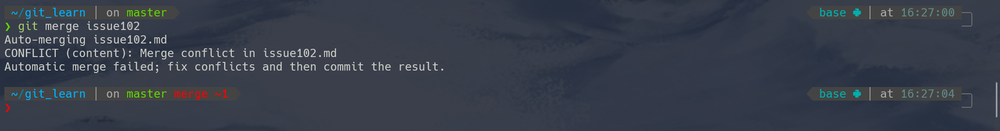
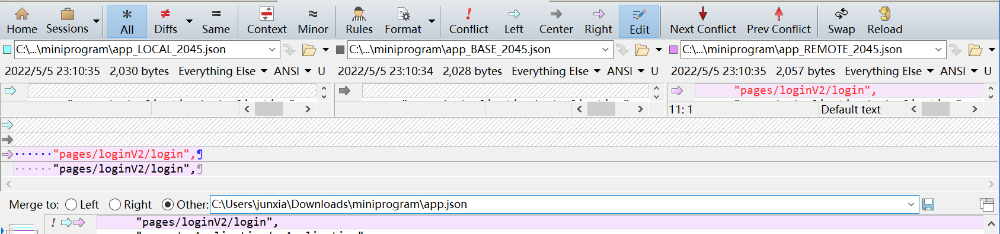

# 第十章 Git 团队协作以及合并时的 diff 工具

> Author：JunXia

## 10.0 引言

在许多的多人组队（编程）任务、尤其是需要进行交叉修改代码中部分段落的时候，Git 这样一个分布式版本控制系统的优势就体现出来，或许这也是一些人开始接触和使用 Git 的原因。（笔者也是如此！）

实际上本项目也是通过这样团队协作的形式来完成的。在本项目的最后，我们也简单介绍一下 Git 团队协作通常的“打开方式”。

[//]: # " 在实际项目开发工作中，常常会有自测、联调、提测、线上紧急修复等多工作环节，对应可能需要本地、内测、开发、测试、生产等多环境部署代码的需求，对应每个环节会产生不同的分支；本⽂将从 Git-Flow 模型原理出发，通过命令行演示实际可操作⼿段并进⾏总结，最终希望 Git-Flow 在实际项⽬中应⽤起来，从⽽⾼效完成代码开发、版本管理等实际⼯作。"

[//]: #
[//]: # "（注：不同的公司或者不同的项目的 GitFlow 工作流模型标准也不同，具体以实际应用为准；本文提供的为常用模板，较为全面和通用，建议多加练习，达到熟练掌握的程度）"

## 10.1 代码（提交）推送到远程仓库的一般方式

[//]: # " 仍以此前在第三章所提到的 liaoxf？"

### 10.1.1 粗放式的提交：加入仓库协作者，即可获得直接 push 的权限（优点：更方便&快捷）

以 Github 为例，首先，仓库管理员（一般是仓库的创建者或者拥有者）先在 Github 上仓库的 Settings 页面中点击下图的 `Add People` 按钮，添加合作者：


约定大致的 Commit Message（提交信息）的格式，有 fix，update，merge 等词语放在提交消息的开头，来大致表示这次提交的大致内容。

### 10.1.2 标准式的提交与合并：运用 Pull Requests（优点：更严谨&利于把控每个版本的质量。例如 Forking 工作流）

（Pull Requests 的基本介绍可以参阅第八章的 Pull Requests 和提交 PR 词条。）

本项目采取的正是这种方式，更具体一些来说，使用的是 Forking 工作流，也就是先把仓库 Fork 到个人账号，（为了避免误操作影响主分支，往往还需设置禁用向主仓库直接 push，也就是禁用前一节所述的粗放式提交），然后再用 PR 请求的方式将 fork 的修改提交给仓库管理员审核，审核通过之后再合并入主分支；可以参考 [atlassian文档](https://www.atlassian.com/git/tutorials/comparing-workflows/forking-workflow)

此外，这类比较正式的工作流也往往需要更加严谨的提交信息格式，例如本项目提交信息采用如下格式：

提交信息使用如下格式：`<type>: <short summary>`

```bash
<type>: <short summary>
  │            │
  │            └─⫸ Summary in present tense. Not capitalized. No period at the end.
  │
  └─⫸ Commit Type: lecture{#NO}|others
```

`others` 包括非课程相关的改动，如本 `README.md` 中的变动，`.gitignore` 的调整等。

实际上一些更大型的项目或者企业，可能会涉及到统筹配置多个仓库及其参与者的权限，因此会用到 Projects 以及 Organization 等功能。

## 10.2 代码比较与冲突处理

与团队协作相伴的往往就是修改冲突（Conflit）的问题了，第三章中已经提到了一些处理冲突的一般方法（例如手动修改和暂时终止 Merge 进行排查），这里介绍一个著名的用于进行代码比较的软件——Beyond Compare（或者简称 bc，其官网为<https://www.scootersoftware.com/download.php> ，下文中所使用的版本为 4.4，其他版本可能略有差异，比如对一些路径中含有的版本号数字可能需要微调，但主要功能基本一致）。

将 bc 用作代码比较工具可以较为方便地在 git 中进行配置，且拥有较成熟的图形化界面（对 不同系统的换行符 CR、lF，也能较为合理地自动处理），相比与手动解决冲突的效率还是会好许多。

### 10.2.1 配置 bc

在 bc 完成安装之后：

#### 直接用 git 命令配置

其中 `C:/Program Files (x86)/Beyond Compare 4` 为（32 位版本的）bc4 的默认安装位置，如果安装时自定义了位置，需要相应地修改。（此外，因代码中有若干个带 `\ ` 的转义字符，请注意不要因手滑而删除之。）

（这里是直接做了 git 的全局配置，如果只想让它在某个代码仓库生效可以将下面这段中的 global 都改为 local。）

```shell
$ git config --global diff.tool bc4
$ git config --global difftool.bc4.cmd "\"C:/Program Files (x86)/Beyond Compare 4/BComp.exe\" \"\$LOCAL\" \"\$REMOTE\" \"\$BASE\" \"\$MERGED\""
$ git config --global difftool.bc4.trustExitCode true

$ git config --global merge.tool bc4
$ git config --global mergetool.bc4.cmd "\"C:/Program Files (x86)/Beyond Compare 4/BComp.exe\" \"\$LOCAL\" \"\$REMOTE\" \"\$BASE\" \"\$MERGED\""
$ git config --global mergetool.bc4.trustExitCode true
```

如果输入命令后均无报错，则可跳过下面带括号的这个小节。

#### （或者修改配置文件

打开 global（全局）或者 local（某个项目）的配置文件，全局配置文件一般在用户文件夹下，可用如下命令打开

```shell
$ cd ~
$ vim .gitconfig
```

而 local 的配置文件则是在本地代码仓库文件夹的.git 目录下的 config 文件。当然，在 local 中修改就不会在其他代码仓库文件夹里共用这个配置了。

在文件尾部新建一行，追加如下配置代码 并保存：

```bash
[diff]
tool = bc4
[difftool "bc4"]
cmd = \"C:/Program Files (x86)/Beyond Compare 4/BComp.exe\" \"$LOCAL\" \"$REMOTE\"
[merge]
tool = bc4
[mergetool "bc4"]
cmd = \"C:/Program Files (x86)/Beyond Compare 4/BComp.exe\" \"$LOCAL\" \"$REMOTE\" \"$BASE\" \"$MERGED\"
trustExitCode = true
```

）

### 10.2.2 使用 bc

#### 情形 1：在 merge 中使用

[//]: # "，"

也就是在第三章所提到的“融合到主分支上时就会发生冲突。如下图所示：”（此时分支名右侧往往还会出现 MERGING 的高亮提示。）



此时直接用命令：

```bash
$ git mergetool
```

即可直接 bc 的界面：



bc 较好的功能之一正是在于将 "<<<<<<","=======",">>>>>>" 等分割线转换为更直观的三个完整的小窗口显示，并用色块来标记并可以直接点击选择保留哪些部分，可以直接点击 `Next Section` 以及 `Prev Section` 在各个差异区段间切换，中间小窗口（文件名中一般会加入 BASE）的是差异版本的最近共同祖先，左右分别是冲突的两个版本，修改合并后的完成效果显示在屏幕下半区的大窗口中。最终对比和修改完成并保存后可直接关闭窗口，如有大于一个有差异的文件，bc 会自动打开后续需对比的文件。

保存完成，继续到 git bash 进行 commit 以及 push 就可以愉快地完工啦！！

#### 情形 2：作为替换 diff 命令的一个较直观的图形化界面

在一般情况下可以直接将第三章的 diff 命令直接替换为 difftool，即可在 bc 的界面看到 diff 状态的内容，如下图：


仍可以类似地点击 `Next Section` 以及 `Prev Section` 在各个差异区段间切换，并进行其他修改操作。
