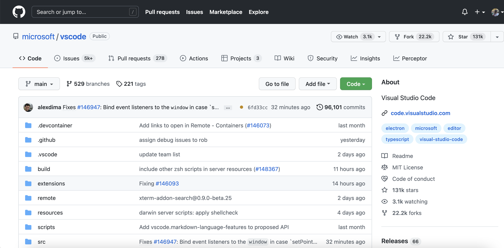
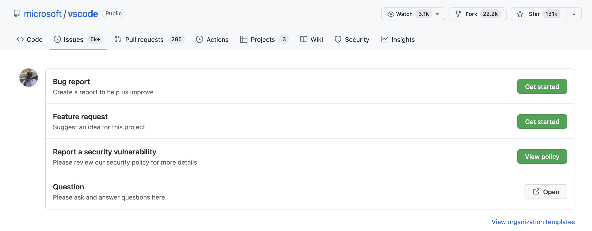
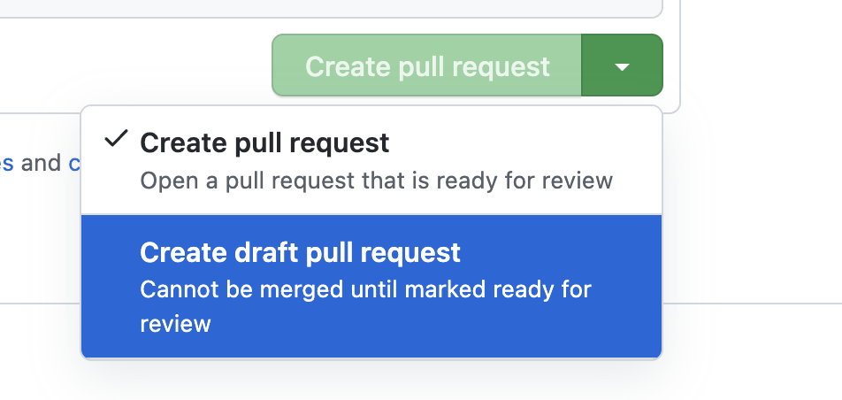
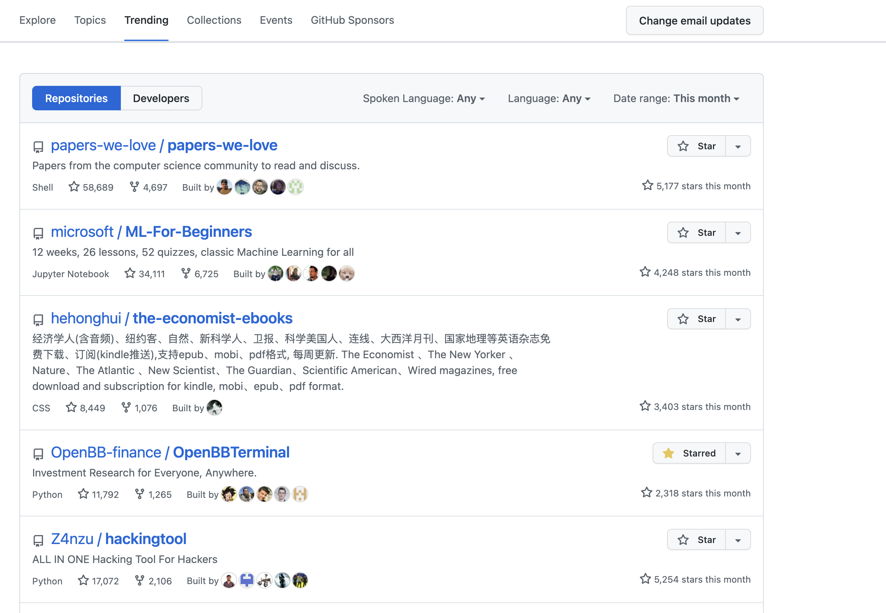
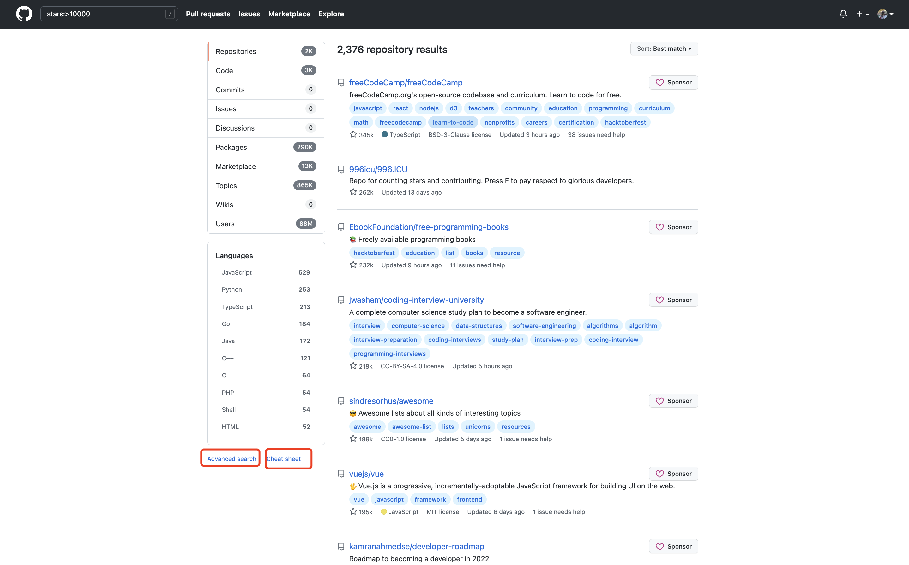

#  第八章 Github/Gitee使用说明

## 8.0 初识GitHub

 可能同学们都或多或少听说过Github，Github是一个使用Git作为版本管理工具的代码托管平台，由于其用户量大并且氛围友好，又经常被大家戏称为“全球最大同性交流平台”。事实上，依赖于git的强大协作能力，Github是开源软件发展的主战场之一。如果还有同学没有注册过github，可以先登陆http://github.com注册账号

## 8.1 使用github托管代码

### 8.1.2 创建仓库

Github上几乎所有的事情都是围绕着仓库展开的。我们首先来学习如何新建一个仓库并满足自己的开发需求

一个GitHub仓库实质上是一个包含了你的项目所有文件的文件夹。 .git文件夹也包含在其中用于版本控制。

登陆GitHub主页，点击右上角+号即可创建一个仓库，如下图：


点击后会跳转到新建仓库的表单，


注意：

1. github上的仓库一般都会包含readme文件，该readme文件会在项目页面进行展示
2. .gitignore文件可以用来忽略工作区的私有文件（例如本地配置、缓存文件、node_modules等）



点击绿色的code按钮，选择相应的协议即可拿到该项目的地址，在本地只需要clone下来就可以进行开发了，开发完成后push到原仓库即可

### 8.1.3 仓库界面介绍

我们以vscode项目进行介绍

访问https://github.com/microsoft/vscode即可看到如下的界面


整个页面的信息量很大，我们主要介绍几个：

#### 页面的左上角：

**Star**：Star类似于朋友圈的点赞，给项目star代表了你对项目的认可

> 所以尽量不要像朋友圈集赞一样要求身边朋友刷star

**Fork**：Fork操作实际上是创建一个仓库的副本，并将仓库的upstream指向原仓库

> 小问题：为什么要fork呢？为什么不直接push呢？
>
> fork方便了多人协作

**Watch**：Watch操作可以向你的邮箱中推送该仓库的推送信息


> 提示：如果不是特别重要的项目，不要随意点fork，否则很容易邮箱被轰炸

**Issues**:Issues在Github官方文档中被翻译为议题，作用是针对仓库的内容进行讨论（例如bug反馈/新功能推荐）

> 提示：Issues不等同于评论区，Issues板块应该专注于解决问题，不要在Issues中发一些和项目无关的内容，这样可能会消耗很多maintainer的精力

**Pull Requests**：Pull Requests，简称PR，是github中将修改过的代码分支合并到目标分支的操作。前面git的学习中，我们都知道commit是git的最小工作单元，在github的仓库中，PR是主要的工作单元。很多同学刚刚接触GitHub时，对于Pull Requests很不理解：什么是拉取请求？在gitlab中，pr的操作叫做Merge Request， 实际上大家可以把PR理解为“我修改好了你的代码，现在请求你把代码拉回主仓库中”

**Action**：Github Action 是GitHub推出的自动化构建工具，感兴趣的同学可以阅读文档

**Projects**：针对某一仓库的项目板（看板）

#### Wiki：  存放一些介绍性的内容

**Security**：与安全相关，这里不做介绍

**Insight**：里面包含里项目的一些数据，包括代码贡献的时间分布图，每个人的贡献量等metric

**discussion**：vscode仓库中并没有开启discussion功能，这里展示一下wagtail社区的，该功能像一个真正的讨论区


## 8.2 提交issue

我们以vscode为例展示提交issue



进入Issues选项卡，可以看到vscode项目已经准备了一些模版，我们点击Bug report


> 提示：在提bug时，请尽可能详细的描述出bug发生的步骤以及所运行的环境（https://stackoverflow.com/help/minimal-reproducible-example）。一般来说，Issue是参与项目贡献的起点，一个高质量的Issue也会让maintainer更愿意交流、处理。

如果你是项目的maintainer，也可以通过右侧对该issue进行更详细的设置，这里不详细介绍了。

## 8.3 提交PR

如果你fork了一份项目代码并做了修改，并且希望将修改的代码合并进上游仓库中，就可以提交PR


上图为vscode的pr界面，点击New pull request即可新建pr。具体的PR流程这里也不详细讲解了。


注意：不是所有的PR都会被合并，所以在提交PR前请先和maintainer进行沟通，并且在开发的过程中反馈进度，一种比较好的方式就是draft PR，如下图所示：



draft PR表示该PR还没有开发完，项目的maintainer不需要进行reveiw和merge，只需要简单看看代码是否符合预期。

>  小提示：在提交PR时，尽可能关联相关Issue，并说明你的代码解决了什么问题。

## 8.4 探索Github

对于大多数程序员来说，Github的一个重要用途就是学习别人的代码，看自己的任务有没有已经写好的轮子可以用。因此如何高效的探索Github也是很重要的，这里给大家介绍几种探索GitHub的小技巧

1. GitHub Explore

点击GitHub最上方的Explore或输入https://github.com/explore即可进入。Explore板块不仅可以根据你的兴趣进行项目的推荐，而且Trending榜展示了当前综合热度最高的项目。关注Trending可以随时掌握整个Github的最新动向

> 补充 https://kamranahmed.info/githunt/也是一个追踪热门项目的网站

2.  GitHub 快捷键

GitHub网站拥有一系列快捷键，你可以通过快捷键来完成你想要完成的动作，例如ctrl/command+k会调起一个类似于powertoy一样的搜索框，在这里你可以直接进行搜索。


类似的快捷键有很多，完整的快捷键见文档https://docs.github.com/cn/get-started/using-github/keyboard-shortcuts

3. 高级搜索

高效的搜索方式可以节约你很多时间，例如下面代码可以帮助你找到Github中star量超过10000的项目

```
stars:>10000
```



其他搜索技巧可以参考上图红框中的链接

4. 内置IDE --- CodeSpace

在你的仓库界面，输入英文状态下的 `.`，即可进入该项目的web editor，这实质上是一个云端的vscode，方便用户查找编辑代码。很可惜现在CodeSpace还不能支持在线运行代码，一些简单的修改可以配合Action使用

5. Copilot

Copilot是Github通过公开代码训练的一个强大的代码补全工具，现在还在内测阶段，有感兴趣的同学可以在https://copilot.github.com/申请，这里不过多介绍了

6. 用户主页

用户主页也是探索Github很好的地方，我的用户主页如下图


左边展示了你参与过的项目，右边展示了Github Explore推荐的项目，中间展示了你Follow的用户最近的动态通常来说，你Follow的用户越多，主页动态越精彩。

>  补充资料：思否今年做过一个中国开源爱好者榜单，有兴趣的同学可以看下https://github.com/OpenSourceWin/hacking-force

7. 用数据探索GitHub--Github API

Github对针对开发者提供了一系列API，详情见https://docs.github.com/en/developers。通过API可以对数据采集分析，探索更微观的GitHub。也有开源项目专门做这件事情，例如open-digger开源项目（https://github.com/X-lab2017/open-digger），感兴趣的同学去自己探索下，这里也不多讲了。

8. 保持清醒 保持正义

Github不是法外之地，如果有遇到代码滥用行为或者政治/宗教等歧视行为，请毫不犹豫地举报！


>  **练习一**：github readme-profile练习

> **练习二**：小组内PR练习


## 8.5 国内其他代码托管平台简介

Gitee/Coding/jihulab

作为代码托管平台，Github由于网速等原因的限制，访问起来会很慢，这时可以采用国内的代码托管平台，这里我们只介绍下Gitee

网址：https://gitee.com/

Gitee整体的功能与github相差不大，这里就不多介绍了，等待大家的探索。

下面我们讲一下，如何通过Gitee 克隆Github上的项目

在Gitee创建仓库时，点击右上角`点击导入`


即可导入其他平台项目，并享受高速的克隆速度。非常方便～

如果大家想将代码回传到GitHub中，请复习git remote相关知识进行操作。


----

本章内容就介绍到这里了，下面是一些补充资料：

补充资料一：一些Git相关的开源仓库

Progit2:https://github.com/progit/progit2

git-cheat-sheet:https://github.com/arslanbilal/git-cheat-sheet

githug--一个ruby编写的git练习游戏:https://github.com/Gazler/githug

gitignore模版：https://github.com/github/gitignore

git-extras：https://github.com/tj/git-extras

git-recipes：https://github.com/geeeeeeeeek/git-recipes


补充资料二：GitHub高赞项目推荐

awesome系列：

主仓库https://github.com/sindresorhus/awesome

周刊系列：

https://github.com/GrowingGit/GitHub-Chinese-Top-Charts

https://github.com/ruanyf/weekly

https://github.com/GitHubDaily/GitHubDaily

资源集合系列：

https://github.com/papers-we-love/papers-we-love

https://github.com/public-apis/public-apis

https://github.com/danistefanovic/build-your-own-x

https://github.com/GorvGoyl/Clone-Wars

https://github.com/TheAlgorithms

这里只列出了一小部分项目，感兴趣的同学可以在学习群里交流～


